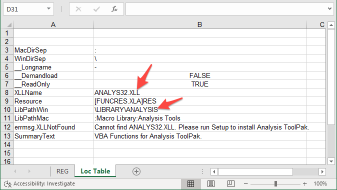

## URL

[A phishing document signed by Microsoft](https://outflank.nl/blog/2021/12/09/a-phishing-document-signed-by-microsoft/)

## **Target**

Microsoft Excel

## **Explain**

Microsoft Excel의 취약점을 악용해 임의 코드를 로드하고 실행하는 phishing document를 만들수 있습니다. MS Office 설치 파일은 서명된 Microsoft Analysis ToolPak Excel add-in이 포함되어 있는데, 해당 XLAM add-in에 취약점이 있기 때문에 해커는 서명의 유효성을 깨트리지 않고 악성코드를 삽입할 수 있습니다.

ATPVBAEN.XLAM은 ANAYS32.XLL을 로드하고 export함수를 사용합니다. XLAM에는 서명된 VBA 코드와 Excel worksheet가 포함되어있는데, Excel worksheet에는  XLL을 로드하기 위해 필요한 `LibPath`와 `XLLName`등의 데이터가 저장되어있습니다. 문제는 해커가 해당 Excel worksheet의 데이터를 어떠한 제약없이 수정할 수 있다는 것입니다.

원본 XLAM을 다른 폴더로 복사하고 동일한 위치에 ANALYS32.XLL이라는 이름의 악성 XLL파일을 추가하면 함수 `RegisterXLL`은 어떤 경고나 검증 없이 조작된 `LibPath` 와 `XLLName` 값에 따라 악성 XLL파일을 load 하게 됩니다.

