# Introduction

2017년에 큰 변화가 있었습니다. 그 해에 보고된 새로운 취약점의 수는 약 14,000개로, 전년보다 두 배 이상 많습니다. 아마 그 이유는 자동 취약점 탐색 툴인 "퍼저"의 인기가 높아졌기 때문일 겁니다.

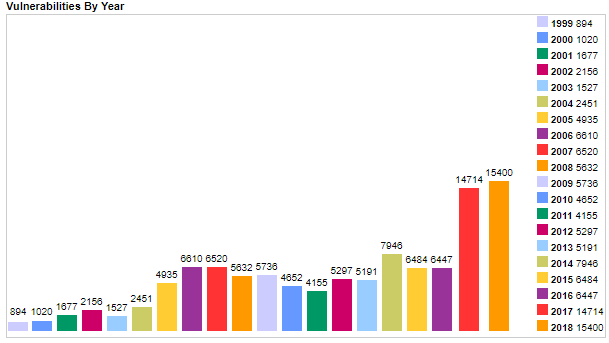

퍼저 자체는 20년 이상 존재해 왔고 그리 새로운 기술은 아닙니다. 하지만 주목해야 할 사실은 퍼저들이 발전했다는 겁니다. 그들은 더욱 뛰어난 기능과 쉬운 접근성을 가지게 됐으며 무엇보다 완성도가 높아졌습니다. 그럼에도 불구하고, 퍼저를 사용하는 것은 "어두운 예술"이라는 평판을 가지고 있기 때문에 많은 연구자들은 퍼저를 사용하는 것을 꺼려합니다.

위의 모든 것을 고려해 볼 때, 다음과 같은 질문을 해볼 수 있습니다. "더 많은 연구자들이 더 많은 취약점을 찾기 위해 퍼저를 사용하고 있다. 하지만 *모든* 연구자들이 *모든* 취약점을 찾기 위해 퍼저를 사용하고 있을까?" "FUZZ라고 적힌 커다란 버튼을 누르기만 하면 찾을 수 있는, 거저먹을 수 있는 취약점들이 얼마나 있을까?"

그 답을 알기 위해, 저희는 저희가 생각할 수 있는 가장 흔한 실험을 만들었습니다. 가장 일반적인 Windows 퍼징 프레임워크 중 하나인 WinAFL과 세계에서 가장 인기 있는 소프트웨어 제품 중 하나인 Adobe Reader를 사용했습니다. 저희는 코드를 분석하고, 취약점이 있을 만한 라이브러리를 찾아 harness를 작성하고, 마지막으로 퍼징 등 전체 작업에 50일의 기간을 설정했습니다.

결과는 매우 충격적이었습니다. 50일 동안 Adobe Reader에서 50개 이상의 새로운 취약점을 발견할 수 있었습니다. 이는 하루 평균 1개의 취약점으로, 이러한 유형의 연구에서는 흔하지 않은 속도입니다.

이 글을 통해 해당 연구의 전말을 알려드리려 합니다. 검색 범위를 넓히기 위해 사용한 새로운 방법론, WinAFL을 개선한 방법, 그리고 마지막으로 그 과정에서 얻은 지식을 공유하려 합니다.


# What is WinAFL?

AFL은 coverage guided genetic fuzzer로, 실제 프로그램에서 버그를 찾는 데 매우 영리한 휴리스틱을 갖고 있습니다.

WinAFL은 Windows용 AFL로 Ivan Fratric(Google Project Zero)에 의해 만들어지고 관리되고 있습니다. Closed source 바이너리를 타겟으로 한 여러 instrumentation을 사용합니다.

우선 AFL이 어떻게 동작하는지 자세하게 적혀있는 AFL 기술 문서를 읽는 것을 추천합니다. 또한 단점을 지적하고 문제가 발생했을 때 디버깅할 수 있도록 도와줍니다.

WinAFL은 압축 바이너리 형식(이미지, 비디오, 아카이브)의 파일 포맷 버그를 찾는데 매우 효과적입니다.


# Attacking Acrobat Reader DC

우선 메인 바이너리 AcroRd32.exe부터 시작해 봅시다.  AcroRD32.dll 주변의 (상대적으로) 얇은 wrapper이며 대략 30MB입니다. AcroRD32.dll은 많은 코드가 있습니다. 그중 일부는 PDF 오브젝트에 대한 파서가 포함되어 있고 대부분은 GUI 코드(일반적으로 GUI 코드에선 버그를 찾지 않음)입니다.

WinAFL은 바이너리 포맷에 효과적이므로 특정 파서를 공격하는데 집중하기로 했습니다. 문제는 파서를 찾아서 파서를 위한 harness를 작성하는 것입니다. Harness란 정확히 무엇인지 잠시 후에 설명하겠습니다.

전체 Reader 프로세스를 로드하지 않고도 로드할 수 있는 바이너리 포맷의 파서를 찾아야 합니다.

Acrobat의 폴더에서 DLL을 탐색한 결과 JP2KLib.dll이 이상적인 타겟임을 확인했습니다.

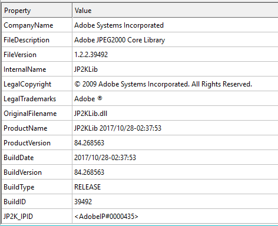

JP2KLib.dll은 JPEG2000 포맷의 파서로 상당히 유용한 함수를 export 합니다.

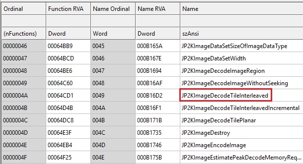

이번 연구의 타겟은 다음과 같습니다.

Acrobat Reader DC ≤ 2018.011.238

JP2KLib.dll 1.2.2.39492


# What is a Target Function?

[타겟함수](https://github.com/googleprojectzero/winafl#how-to-select-a-target-function)는 WinAFL이 퍼징 프로세스의 엔트리 포인트로 사용된는 함수를 뜻합니다. fuzz_iteration 횟수만큼 반복 호출되며 각 실행마다 input 파일을 뮤테이트합니다.

타겟 함수는:

input 파일을 열고, 파일을 읽고, 파일을 파싱 한 후 닫아야 합니다.

C++ exception 혹은 TermainateProcess를 호출하지 않고 정상적으로 리턴해야 합니다.

이런 함수를 찾기란 쉽지 않고 따라서 복잡한 소프트웨어가 타겟일 땐 대개 harness를 작성해야 합니다.


# What is a Harness?

Harness는 퍼징 하려는 함수를 트리거하는 작은 프로그램입니다. Harness는 타겟 함수를 포함하고 있어야 합니다. 다음은 WinAFL 레포에 포함된 gdiplus에 대한 간단한 예제 harness입니다.

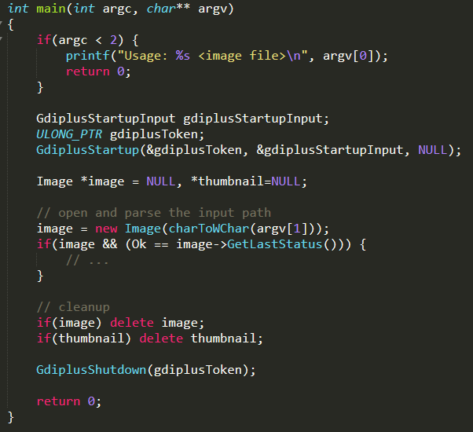

main의 첫 argument는 경로입니다. 함수 내에서 퍼징 하려는 API인 Image::Image parser를 다음과 같이 호출합니다. 오류 발생 시 프로세스를 종료하지 않고 마지막에 모든 리소스를 해제합니다.

이 프로세스는 문서화된 API에서 비교적 쉽습니다. 문서를 사용해 샘플 코드를 복사하거나 간단한 프로그램을 작성할 수 있습니다. 하지만 그러면 너무 쉽죠?

Closed Source 바이너리인 Adobe Reader를 타겟으로 선택했습니다. 이런 타겟의 Harness 작성법은 다음과 같습니다.

1. 퍼징 할만한 함수를 찾습니다.
2. 리버싱을 통해 분석합니다.
3. 해당 API를 호출하는 프로그램을 작성합니다.
4. 잘 작동하는 Harness를 만들 때까지 반복합니다.

다음 섹션에서는 JP2KLib.dll을 리버싱 하고 작동하는 하니스를 작성하는 방법을 자세히 설명합니다. 간략한 방법론에만 관심이 있는 독자들은 다음 섹션으로 건너뛰시길 바랍니다.


# Writing a Harness for JP2KLib.dll

JP2KLib.dll의 리버싱을 시작하기 전에, 먼저 해당 라이브러리가 오픈소스인지 혹은 public 심볼을 갖는지 확인해야합니다. 많은 시간을 절약할 수 있고 생각보다 흔한 일이지만 저희의 경우에는 운이 별로 좋지 않았습니다.

저희는 Adobe Reader가 JP2KLib를 사용하는 방식과 최대한 유사한 Harness를 작성하고 싶기 때문에 먼저 적절한 PDF파일을 찾아야 했습니다.

저희는 제품 테스트용 PDF corpus를 많이 가지고 있습니다. 그중 JPEG2000용 PDF 필터인 "/JPXdecode"에 해당하는 가장 간단한 예제를 사용했습니다. 구글링 또는 Abrocat Pro/Phantom PDF를 사용해 testcase를 생성할 수도 있습니다.

Pro Tip 1: reader에 샌드박스가 있어 debugging/triaging에 성가신 경우가 있으므로 이 기능을 사용하지 않도록 설절할 수 있습니다.

https://forums.adobe.com/thread/2110951

Pro Tip 2: [PageHeap](https://docs.microsoft.com/en-us/windows-hardware/drivers/debugger/gflags-and-pageheap)을 설정하여 할당 위치와 크기를 추적하는 것으로 리버싱 작업을 수월하게 만들 수 있습니다.

PDF wrapper 없이도 harness에 사용할 수 있도록 샘플 중에서 추출하여 jp2 파일을 추출했습니다. 나중에 harness의 test input으로 사용할 것들입니다.

작동하는 최소 샘플을 얻었으니 "sxe ld jp2klib"을 사용해 JP2KLib.dll이 로드되는 시점에 브레이크 포인트를 걸어줍니다. 브레이크 포인트가 걸리면 JP2KLib의 모든 export 함수에 브레이크 포인트를 걸어 줍니다. 브레이크 포인트 명령어는 모든 call stack, 인자, 리턴 값을 기록합니다.

```bash
bm /a jp2klib!* “.echo callstack; k L5; .echo parameters:;  dc esp L8;  .echo return value: ; pt; ”
```

샘플 PDF를 로드해 다음과 같은 output을 얻었습니다.

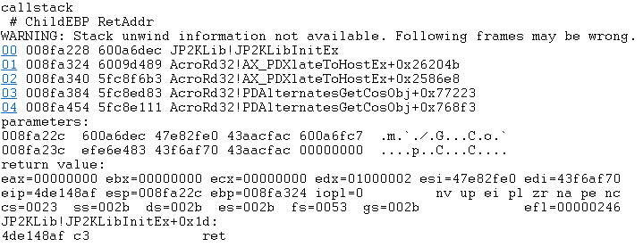

JP2KLib가 로드된 후 첫 번째로 호출되는 함수는 JP2KLibInitEx입니다. JP2KLibInitEx가 받는 인자를 분석해 봅시다.

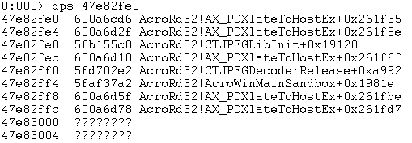

AcrobRd32.dll의 함수를 가리키는 포인트가 담긴 0x20 크기의 구조체를 인자로 받습니다. 새로운 함수에 도달했다고 바로 분석하려들면 안됩니다. 그 함수가 타겟 코드에서 쓰일지 모르기 때문입니다. 우선 "nopX"(X는 숫자)라는 이름으로 빈 함수 포인터를 구조체에 넣어놓고 Harness의 뼈대를 만들어 봅시다.

1. Command line argument로부터 input file을 받는다.
2. JP2KLib.dll을 로드한다.
3. 만들어둔 구조체를 인자로 JP2KLibInitEx를 호출합니다.

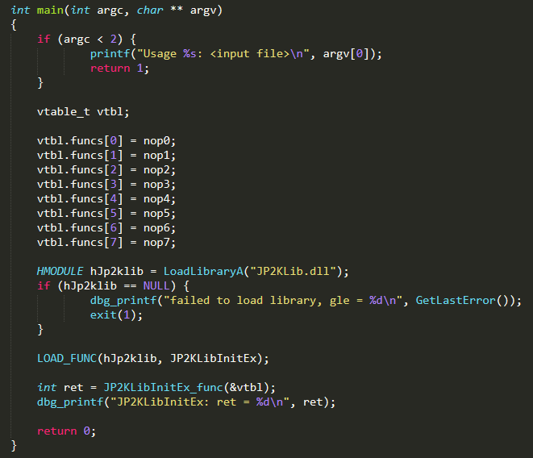

LOAD_FUNC는 저희가 작성한 매크로입니다. nopX 함수를 설정하는 NOP매크로도 있습니다.

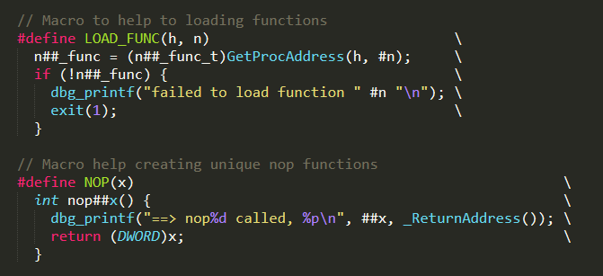

컴파일하고 sample.jp2와 함께 실행해보면 잘 작동합니다.

"g"명령어를 통해 다음 함수로 넘어가 봅시다. 다음으로 실행되는 함수는 JP2KGetMemObjEx이고 어떠한 인자도 받지 않습니다. 따라서 호출하고 리턴 값만 저장합시다.

그다음 함수인 JP2KDecOptCreat 또한 인자를 받지 않습니다. 마찬가지로 호출하고 리턴 값만 저장합니다. 여기서 문제가 발생합니다. JP2KDecOptCreat 내부에서 nop4와 nop7 함수를 호출하는군요. 따라서 각각 구현을 해줘야 합니다.

이제 nop4가 어떤 동작을 하는지 알아내야 합니다. nop4에 해당하는 실제 함수 AcroRd32!CTJPEGDecoderRelease+0xa992 에 브레이크 포인트를 걸어줍니다.


그리고 계속 실행하다보면


이곳에 도달합니다.


즉, nop4는 malloc의 wrapper함수입니다. 저희가 직접 구현한 뒤 nop4와 바꿔줍니다. nop7(memset), nop5(free), nop6(memcpy)에 대해서도 동일한 작업을 해줍니다.

그다음 함수인 JP2KDecOptInitToDefaults 인자를 받지 않습니다. 호출하고 리턴 값을 저장합니다.

현재 harness의 모습은 다음과 같습니다.

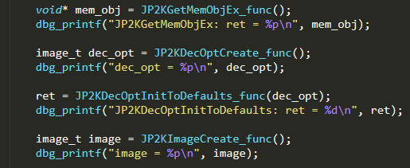

다음 함수인 JP2KImageInitDecoderEx는 5개의 인자를 받습니다!

5개의 인자 중 3개는 JP2KImageCreate, JP2KDecOptCreate, JP2KGetMemObjEx의 리턴 값입니다.

세 번째 인자는 vtable을 가리키는 포인터입니다. 지금까지 사용한 트릭을 똑같이 반복합니다. nop을 담고 있는 구조체를 인자로 함수를 호출합니다.

두 번째 인자는 구조체입니다. 함수 포인터를 담고 있지 않기 때문에 상수값 0xbaaddaab를 보내줍니다.

현재 harness의 모습은 다음과 같습니다.

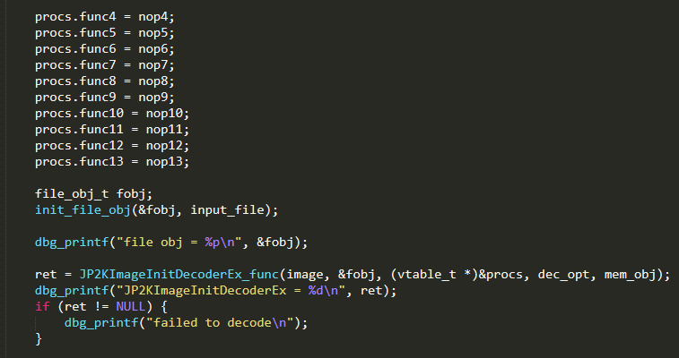

harness를 실행해보니 nop10으로 도달했습니다. nop10의 실제 함수에 브레이크 포인트를 걸면 다음과 같은 call stack을 얻을 수 있습니다.


JP2KCodeStm::IsSeekable를 IDA로 살펴봅시다.


JP2KCodeStm의 0x24 오프셋에 이전 단계에 넣어준 vtable이, 0x18 오프셋에 0xbaaddaab 상수값이 있는 것을 Windbg로 확인할 수 있습니다. JP2KCodeStm::IsSeekable은 0xbaaddaab를 인자로 vtable에 있는 함수를 호출합니다.

각 파서마다 다르겠지만 일반적으로 익숙한 파일 인터페이스(FILE/ifstream)에 존재하는 input stream을 사용합니다. 일종의 input stream(network/file/memory) 추상화입니다. 저희는 JP2KCodeStm의 동작을 보고 바로 알아차렸습니다.

0xbaaddaab는 스트림 오브젝트이고 vtable은 그 스트림 오브젝트에 대한 함수들입니다. IDA로 돌아가 JP2KCodeStm::XXX 함수들을 확인해 봅시다.

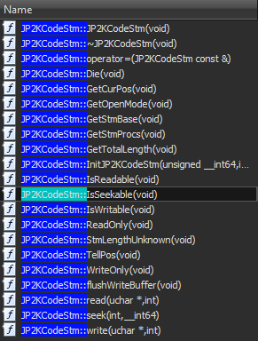

대부분 유사한 방식을 사용하기 때문에 직접 파일 오브젝트를 만들고 필요한 메소드를 구현해봤습니다.

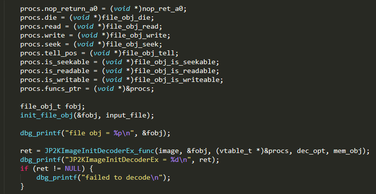

오류가 나면 버리고 아니라면 JP2KImageInitDecoderEx의 리턴 값을 검사하도록 만들었습니다. JP2KImageInitDecoderEx은 성공 시 0을 리턴합니다. 스트림 함수를 구현하는데 몇 번의 시행착오가 있었지만 원하던 리턴 값을 얻는 데 성공했습니다.

다음 함수인 JP2KImageDataCreate는 인자를 받지 않으며 리턴 값을 그다음 함수인 JP2KImageGetMaxRes에 전달합니다. 호출하고 넘어갑니다.

다음은 7개의 인자를 받는 JP2KImageDecodeTileInterleaved 함수입니다. 7개의 인자 중 3개는 JP2KImageCreate, JP2KImageGetMaxRes, JP2KImageDataCreate의 리턴 값입니다.

IDA로 확인해본 결과 두 번째 그리고 6번째 인자는 NULL입니다.

네 번째, 다섯 번째 인자는 color depth와 관련된 인자로 저희는 이 두 값이 고정된 체로 퍼징을 하기로 결정했습니다.


최종적으로 JP2KImageDataDestroy, JP2KImageDestroy, JP2KDecOptDestroy 함수들을 호출해 저희가 만든 오프젝트들을 해제해 memory leak을 방지합니다. 이 작업은 WinAFL로 fuzz_iterations가 높은 작업을 할 때 중요합니다.

자 이제 잘 작동하는 Harness를 완성했습니다!

아주 사소한 수정을 해줍니다. JP2KLib을 로드하고 필요한 함수를 받아오는 초기화 작업을 분리합니다. 매 실행마다 초기화 작업을 다시 해 줄 필요가 없으니 이를 분리해줌으로써 실행 속도를 향상할 수 있습니다. 새로운 함수에 fuzzme라는 이름을 지어주고 export 해줍니다. 유효한 오프셋을 구하는 것보다 export 하는 것이 훨씬 쉽습니다.

# Fuzzing Methodology

1. Basic tests for the harness
   1. Stability
   2. Paths
   3. Timeouts
2. Fuzzing Setup
3. Initial corpus
4. Initial line coverage
5. Fuzzing loop
   1. Fuzz
   2. Check coverage / crashes
   3. cmin & repeat
6. Triage

# Basic Tests for the Harness

퍼징을 시작하기 앞서 몇 가지 sanity test를 해야 합니다. 그저 서버실 온도만 높이는 일이 발생할 수 있으니. 첫 번째로 확인해야 할 것은 퍼저가 새로운 실행 path에 도달하는가입니다. 즉, total path count가 꾸준히 상승하는지 확인해야 합니다.

만약 path count가 0이거나 거의 0이라면 다음과 같은 함정들을 조사해봐야 합니다.

- 컴파일러에 의해 타겟함수가 인라인 처리되어 WinAFL이 도달하지 못한다.
- 인자 개수나 함수 호출 규약이 잘못됐다.
- 타임아웃이 너무 낮아 harness가 너무 일찍 종료된다.

퍼저를 몇 분 정도 실행한 뒤 안정성을 확인했습니다. 안정성이 낮아(80% 미만) 이슈를 디버깅해봤습니다. Harness의 안정성은 퍼저의 성능과 직결되기 때문에 매우 중요합니다.

흔히 빠지는 함정들

- 난수 element들을 확인해봐야 합니다. 예를 들어 몇몇 hash table들은 collision을 방지하기 위해 난수를 사용합니다. 이는 coverage의 정확도를 떨어뜨리는 작업이므로 난수의 seed를 상수값으로 고정시키는 패치를 해줍니다.
- 몇몇 소프트웨어는 특정 global object에 대한 cach를 사용합니다. nop run을 통해 이를 방지합니다.
- Windows 10 64-bit 시스템에서 돌아가는 32-bit 타겟의 stack alignment는 항상 8이 아닙니다. 이는 memcpy를 포함한 다른 AVX 최적화 코드들의 동작에 영향을 주며 coverage 또한 영향을 받습니다. harness에 stack aligne을 맞추는 코드를 추가하는 방법으로 해결할 수 있습니다.

만약 위 방법이 모두 실패한다면 DynamoRIO를 사용해 harness의 인스트럭션을 추적하고 output을 비교합니다.

# Fuzzing Setup

저희는 다음 과 같은 VM을 사용합니다.

8~16 core, 32 GB of RAM, Windows 10 x64

저희는 [ImDisk toolkit](https://sourceforge.net/projects/imdisk-toolkit/)을 사용해 RAM disk drive를 사용합니다. 빠른 타겟을 대상으로 디스크에 test case를 작성하는 것은 병목 현상을 유발하기 때문입니다.

Windows Defender 또한 성능에 악영향을 끼치니 비활성화해줍니다. WinAFL이 생성하는 test case들 중 Windows Defender에서 알려진 exploit으로 처리하는 경우도 있습니다.

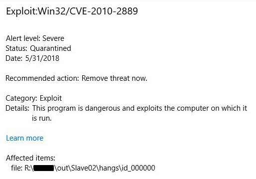

Windows Indexing Service도 비활성화해줍니다.

퍼징 도중 시스템을 재시작하거나 퍼징 하던 dll을 대체하는 등의 문제가 발생할 수 있으니 Windows Update도 비활성화해줍니다.

버그 탐색에 도움이 되므로 harness 프로세스에 대한 page heap은 활성화해줍니다.

속도는 느리지만 버그 탐색에 효과적이라는 edge coverage type을 사용했습니다.

퍼징을 시작하는 명령어는 다음과 같습니다.

```bash
afl-fuzz.exe -i R:\\jp2k\\in -o R:\\jp2k\\out -t 20000+ -D c:\\DynamoRIO-Windows-7.0.0-RC1\\bin32 -S Slav02 — -fuzz_iterations 10000 -coverage_module JP2KLib.dll -target_module adobe_jp2k.exe -target_method fuzzme -nargs 1 -covtype edge — adobe_jp2k.exe @@
```


# Initial Corpus

Harness를 완성했다면 아래 방법들로 초기 corpus를 확보해야 합니다.

- Online corpuses ( [afl corpus](https://lcamtuf.coredump.cx/afl/demo/), [openjpeg-data](https://github.com/uclouvain/openjpeg-data) )
- Test suites from open source projects
- Crawlling google / duckduckgo
- Corpuses from our older fuzzing projects


# Corpus Minimization

동일한 coverage를 생성하는 용량이 큰 파일을 사용하면 퍼저의 성능이 저하됩니다. AFL은 이를 해결하기 위해 afl-cmin을 사용해 corpus를 간소화 시킵니다. WinAFL은 winafl-cmin.py라는 툴을 제공합니다.

확보한 모든 파일을 winafl-cmin.py에 넣고 간소화된 corpus를 얻을 수 있습니다.

같은 파일에 대해 winafl-cmin을 두 번 돌려보고 같은 결과가 나오는지 비교해봐야 합니다. 만약 두 결과가 다르다면 harness가 비결정론 문제를 안고 있다고 볼 수 있습니다.


# Initial Line Coverage

Corpus를 얻었으니 이젠 line coverage를 살펴볼 차례입니다. Line coverage란 실제로 실행된 어셈블리 인스트럭션을 뜻합니다. DynamoRIO를 사용해 line coverage를 얻을 수 있습니다.

```bash
[dynamoriodir]\\bin32\\drrun.exe -t drcov — harness.exe testcase
```

각 test case에 대해 위 명령어를 실행하고 결과값을 IDA [Lighthouse](https://github.com/gaasedelen/lighthouse)로 확인합니다.

는데 도움이 됩니다.


# Fuzzing Cycle

다음 단계는 매우 간단합니다.

1. 퍼저를 실행한다.
2. Coverage와 Crash 분석
3. Coverage 조사, cmin 그리고 반복

퍼저를 돌리는 것은 특별히 어려운 일이 아닙니다. 위에서 설명한 구성대로 퍼저를 실행하기만 하면 됩니다.

저희는 다음과 같은 기능의 봇을 사용합니다.

1. 모든 퍼저의 상태([winafl-whatsapp.py](http://winafl-whatsapp.py))
2. 각 퍼저의 시간에 따른 path 변화 그래프
3. Crash triage (다음 섹션에서 다룸)
4. 멈춘 퍼저 재시작

위 작업들을 자동화하는 것이 얼마나 중요한지 굳이 설명할 필요는 없겠죠? 퍼징은 지루하고 오류가 넘치는 작업입니다.

퍼저의 상태와 path를 몇 시간 주기로 확인하고 그래프에 상승세가 보인다면 coverage를 조사합니다.


모든 퍼저의 모든 queue를 모아 cmin을 거치고 그 결과를 IDA로 확인합니다. 상대적으로 coverage가 작으면서 크기가 큰 함수를 찾습니다. 각 함수의 기능을 이해하려 노력하고 각 샘플이 어떤 기능을 트리거하는지 확인합니다.

이번 단계는 매우 중요합니다. 하나의 샘플을 추가하고 몇 시간의 퍼징을 통해 새로운 취약점 3개를 찾았습니다.

Coverage가 더 이상 늘어나지 않을 때까지 이 사이클을 반복했습니다. Coverage가 늘어나지 않는다는 뜻은 타겟을 변경하거나 harness를 개선해야 한다는 뜻입니다.


# Triage

Crash를 발생시키는 test case를 얻으면 직접 crash와 그 입력값을 분석했습니다. 하지만 중복된 결과가 많아 빠르게 전략을 바꿨습니다. [Bugld](https://github.com/SkyLined/BugId)를 사용해 중복된 결과를 생략하고 unique crash에 대한 minimize 작업을 자동화했습니다.

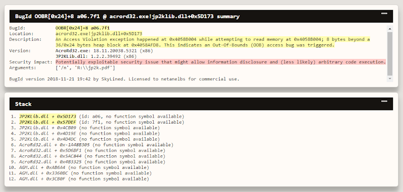


# What We Found

이런 전략을 통해 Adobe Reader와 Adobe Pro에서 53개의 critical 한 버그를 발견할 수 있었습니다.

저희는 다른 이미지 파서 스트림 디코더 등에 이러한 프로세스를 적용해봤고 아래와 같은 CVE들을 얻을 수 있었습니다.

CVE-2018-4985, CVE-2018-5063, CVE-2018-5064, CVE-2018-5065, CVE-2018-5068, CVE-2018-5069, CVE-2018-5070, CVE-2018-12754, CVE-2018-12755, CVE-2018-12764, CVE-2018-12765, CVE-2018-12766, CVE-2018-12767, CVE-2018-12768, CVE-2018-12848, CVE-2018-12849, CVE-2018-12850, CVE-2018-12840, CVE-2018-15956, CVE-2018-15955, CVE-2018-15954,CVE-2018-15953, CVE-2018-15952, CVE-2018-15938, CVE-2018-15937, CVE-2018-15936, CVE-2018-15935, CVE-2018-15934, CVE-2018-15933, CVE-2018-15932 , CVE-2018-15931, CVE-2018-15930 , CVE-2018-15929, CVE-2018-15928, CVE-2018-15927, CVE-2018-12875, CVE-2018-12874 , CVE-2018-12873, CVE-2018-12872,CVE-2018-12871, CVE-2018-12870, CVE-2018-12869, CVE-2018-12867 , CVE-2018-12866, CVE-2018-12865 , CVE-2018-12864 , CVE-2018-12863, CVE-2018-12862, CVE-2018-12861, CVE-2018-12860, CVE-2018-12859, CVE-2018-12857, CVE-2018-12839, CVE-2018-8464

jp2k에서 발견한 취약점 중 하나는 [실제 공격](https://www.welivesecurity.com/2018/05/15/tale-two-zero-days/)에 악용되고 있는 것으로 확인되어 발견하고 얼마 지나지 않아 Adobe에 제보했습니다.

물론 Adobe Reader의 샌드박스와 Reader Protected Mode는 exploit의 복잡도를 크게 증가시켰습니다. 위에서 언급한 공격 사례처럼 샌드 박스로부터 시스템에 영향을 미치기 위해선 또 다른 PE exploit을 요구합니다.

저희는 WinAFL을 사랑하고 더 많이 쓰이길 바라고 있습니다.

WinAFL을 사용하면서 버그나 기능 누락 등을 자주 마주쳤습니다. Windows 10 Appifier에 대한 지원 추가, CPU 선호도, 버그 수정 및 몇 가지 GUI 기능을 추가하고 업스트림 했습니다.

저희 커밋 링크입니다.

Netanel’s commits – https://github.com/googleprojectzero/winafl/commits?author=netanel01

Yoava’s commits – https://github.com/googleprojectzero/winafl/commits?author=yoava333