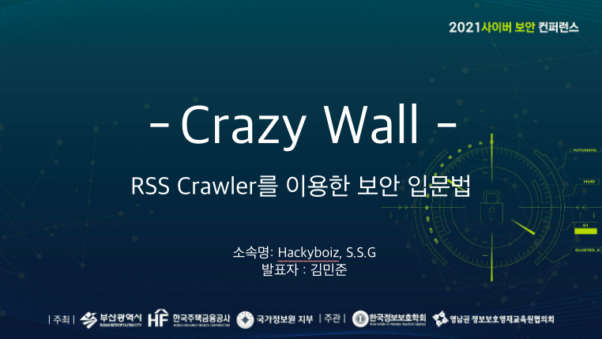

안녕하세요 Fabu1ous입니다. 2021 9월 3일, 부산에서 열린 시원(Security-One) 포럼에서 발표하고 왔습니다. 저희 Hackyboiz 팀에선 어떻게 공부하고 있는지, 이 공부법이 보안 입문자 분들께 어떤 도움이 되는지 소개하는 발표였습니다. 시원 포럼처럼 시 단위 스케일의 자리에서 발표하는 것은 처음이라, 게다가 인터넷 생중계가 되는 발표는 처음이라 많이 긴장해서 내용 전달이 원활하지 못했던 거 같습니다. 그래서 블로그에 좀 더 정돈된 말로 해당 발표를 남깁니다.

해당 발표는 보안 입문자분들을 위해 준비했습니다. 대부분의 보안 입문자분들이 워게임으로 보안에 발을 들이더라고요. 워게임 문제들을 풀다 보면 자연스럽게 지식도 쌓이고 성취감도 얻을 수 있기 때문인 것 같습니다. 그런데 막상 워게임만 풀어오다가 리얼월드에서 경험을 쌓고 실적을 내려고 하면 어디서부터 시작해야 할지 갈피를 못 잡는 경우도 많더라고요. 그래서 저희 Hackyboiz에선 어떤 공부법을 사용하고 있는지, 이 공부법이 앞서 설명한 상황에 처해있는 뉴비들에게 어떻게 도움이 되는지 알려드리겠습니다.

목차입니다.

우선 왜 이런 공부법을 사용하는지, 어떤 글을 어떻게 수집해야 하는지, 글의 종류에 따라 어떤 내용에 주목해야하는지를 간단히 설명하겠습니다. 그리고 제가 1년 반동안 이 공부법을 사용한 경험담을 들려드리면서 어떤 효과를 기대할 수 있는지 알려드리겠습니다.

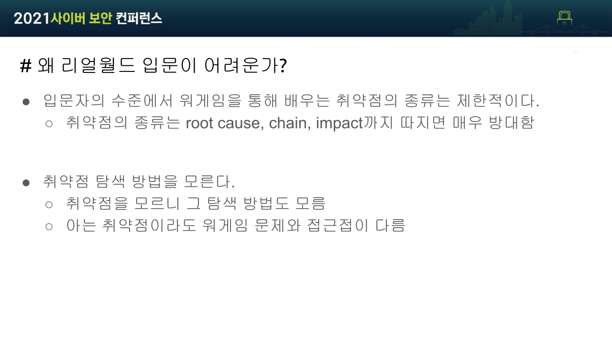

뉴비분들이 리얼월드 입문하는데 어려운 이유는 바로 시야가 좁기 때문이라고 생각합니다. Root cause, Chainning, Impact까지 고려해보면 취약점의 종류는 정말 방대합니다. 그에 반해 입문자 수준에서 워게임을 통해 배울 수 있는 취약점의 종류는 매우 한정적입니다. 컴퓨터에 관심이 조금이라고 있는 사람이라면 이름 한 번쯤은 들어봤을 법한 클래식한 취약점들이 대부분이죠. 근데 이런 취약점들은 굉장히 유명하고 오래되기도 해서 워게임 문제처럼 접근했다가는 크게 고생하게 됩니다.

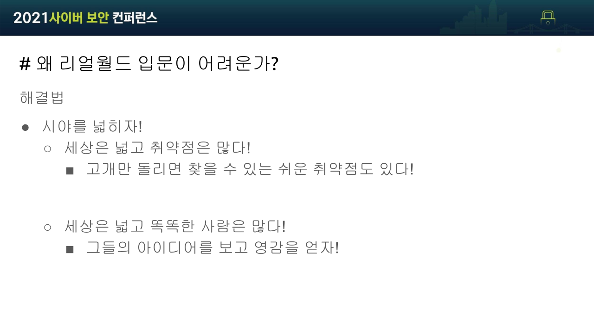

시야를 조금만 넓혀보면 세상엔 정말 다양한 취약점들이 있다는 걸 알 수 있습니다. 또한 많은 연구들이 취약점을 다양한 시각에서 바라볼 수 있도록 아이디어를 제시하고 있다는 사실을 알 수 있습니다.

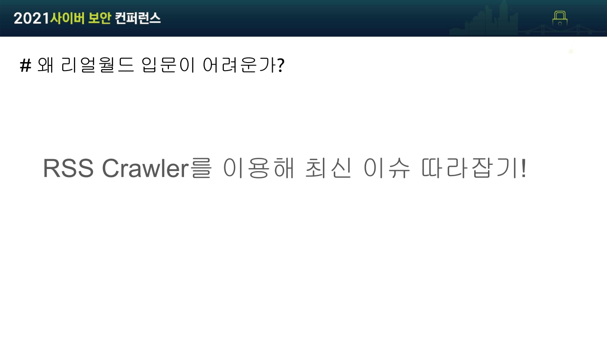

그래서 시야를 넓힐 수 있는 방법이 뭐냐? 바로 RSS Crawler를 이용한 최신 이슈 따라잡기입니다.

저희 Hackyboiz 팀은 최신 보안 이슈를 따라다니며 보안에 대한 시야를 넓히고자 노력하고 있습니다.

RSS(Really Simple Syndication)은 유저 혹은 애플리케이션이 웹사이트의 변경사항을 쉽게 확인할 수 있도록 제공되는 웹 피드입니다. 블로그 플랫폼, 인터넷 기사 서비스 등 대부분의 웹사이트에서 RSS를 제공합니다. RSS 주소를 RSS 리더에 등록해 구독하면 해당 웹사이트에 새로운 컨탠츠가 추가될 때마다 수집할 수 있습니다.

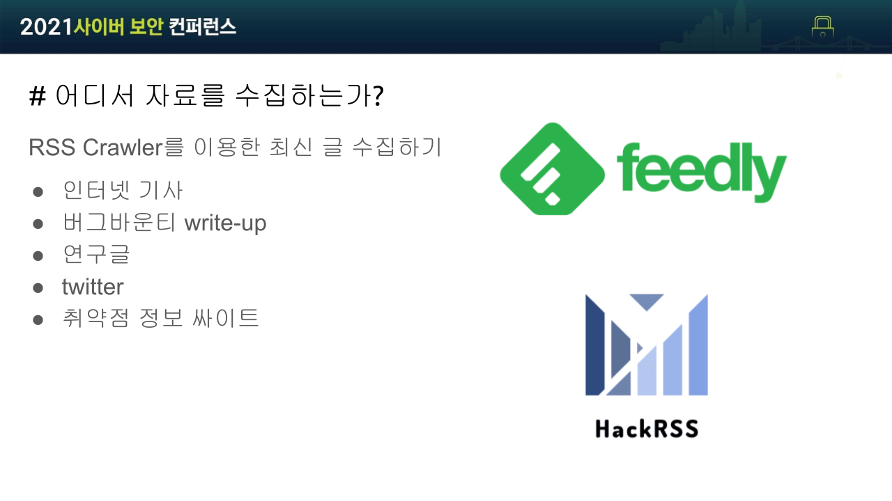

저는 feedly라는 RSS 구독 서비스를 사용하고 있습니다. 유료 서비스를 사용하기 싫으신 분들은 직접 RSS Crawler를 제작하셔서 RSS 피드들을 수집하셔도 됩니다. 저희 Hackyboiz의 개발 HackRSS라는 해킹 관련 RSS 피드를 수집/제공해주는 서비스를 만들었습니다.

이런 RSS 구독 서비스 혹은 RSS Crawler를 이용해 인터넷 기사, 버그바운티 write-up, 연구글, twitter, 취약점 정보 싸이트 등에서 RSS 피드를 수집하시면 됩니다. Twitter 같은 SNS 들의 경우 연구글을 공유하면서 해당 글에 대한 평가와 같은 사설을 담는 경우가 많아 다양한 사람들의 의견을 볼 수 있는 장점이 있습니다.

일정 주기로 수집한 글들 중 흥미로운 것이 있다면 스크랩해 놓으셨다가 시간 날 때 정독하고 정리하는 방식으로 공부하시면 됩니다. 저희 팀은 매일 아침 출근/등교하며 전날 수집된 RSS 피드들을 훑어 보고 그중 흥미로운 글이 있다면 저녁에 정독하는 방식을 사용했습니다.

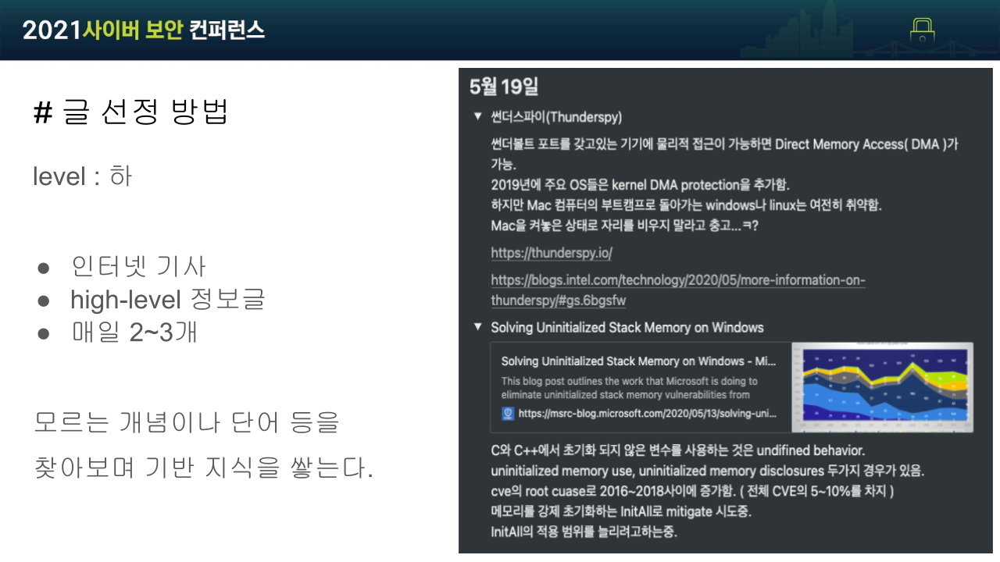

수집되는 글들을 난이도 별로 구분하고 각 난이도 별로 글을 읽는 목적과 주목해야 할 내용 등을 설명하겠습니다. 우선 "난이도 하"입니다.

기술적인 내용을 깊게 다루지 않는 High-level의 정보글들을 "난이도 하"로 잡았습니다. 인터넷 기사를 예로 들 수 있습니다. 이런 글들을 읽을 때는 글의 핵심 내용을 파악하고 새롭게 알게 된 사실 등을 정리하시면 됩니다. 쉬운 글을 위주로 많이 읽으면서 기초지식을 쌓는다고 생각하시면 됩니다.

예시로 2개의 글을 들고 왔습니다.

- 썬더스파이
  - 썬더볼트 포트를 사용하는 기기에 물리적 접근을 통해 메모리속 데이터를 읽고 복사할 수 있는 취약점
  - DMA : CPU의 operation을 거치지 않는 직접적인 메모리 I/O 접근은 Direct Memory Access 취약점
  - 기기에 물리적인 접근을 통해 충전기를 꽂는 Attack surface도 있음
- 초기화되지 않은 변수 사용에 대한 MSRC의 보고서
  - C나 C++에서 초기화되지 않은 변수를 사용하는 것은 Undifined behavior
  - 2016~2018년 동안 해당 버그가 root cause인 취약점이 증가

"난이도 하"는 글의 핵심 내용과 새로 알게된 사실등을 정리하시면 됩니다.

보안뿐만 아니라 IT 전반적인 지식 습득을 목적으로 쉬운 글을 최대한 많이 읽으면서 배경 지식을 쌓는다고 생각하시면 됩니다.

수집하는 RSS 피드를 늘려가다 보면 최근에 자주 언급되는 주제들이 보이기 시작합니다. 해당 주제에 관한 기술적인 문서들을 "난이도 중"으로 선정했습니다. 최근에 자주 언급되는 주제에 대해 어느 정도 컴퓨터 공학 내용이 담긴 글들을 찾아 읽으시면 됩니다.

예시로 들고 온 글은 2020년 8월에 작성한 글입니다. 이때가 Tiger lake라는 하드웨서 레벨의 CET(Control flow Enforcement Tech)를 적용한 CPU가 출시되기 직전이었습니다. 따라서 해당 CPU와 CET, 그리고 CET과 관련된 기술들(CFG, XFG, shadow stack, indirect-branch-tracking)이 자주 언급되었습니다. 예시로 들고 온 글은 CFG의 기술적 배경 설명과 XFG와의 비교 등을 정리한 분석글을 읽고 정리한 것입니다.

"난이도 중"의 글을 읽으실 때 요즘 Hot한 기술이 뭔지, 그리고 그 기술 어떻게 발전해 왔는지 등을 주목하시는 것을 추천합니다. 

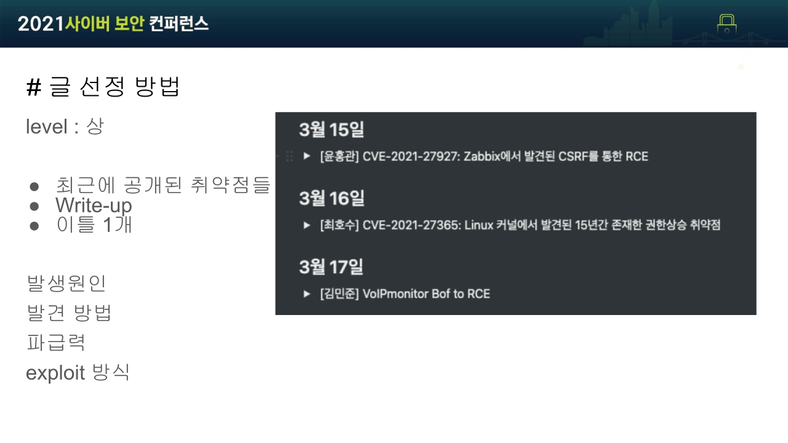

최근에 공개된 버그바운티 write-up, 취약점 PoC, Patch 분석을 통한 1-day 분석글 등을 "난이도 상"으로 선정했습니다. 현재 Hackyboiz 팀 블록그에 업로드되는 "하루한줄" 콘텐츠가 이러한 글들을 읽고 정리한 것들입니다.

이런 글들을 읽으실 땐 아래와 같은 흐름을 집중하시는 게 좋습니다.

- 취약점의 종류는 무엇인지
- root cause가 뭐고 어떻게 chainning 되는지
- 환경에 따라 타겟 시스템에서 할 수 있는 행위가 어떻게 달라지는지
- 그래서 선택한 exploit 방식이 뭔지

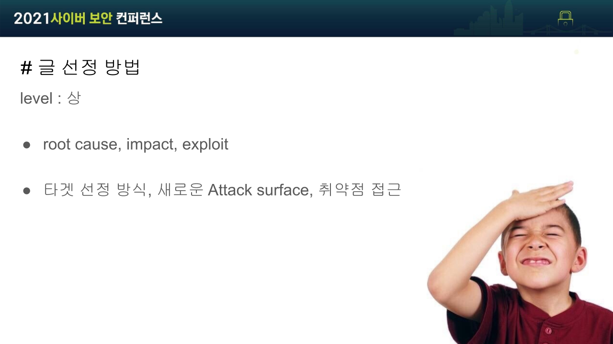

간혹 하나의 타겟에서 다수의 취약점을 찾는 것을 목표로 진행된 연구의 성과를 자랑하는 글들이 있습니다. 이런 글들은 타겟 선정 이유, 새로운 attack surface 제시 등과 같이 취약점 탐색 아이디어에 필요한 insight를 공유하는 경우가 많아서 특별히 더 주목할 필요가 있습니다.

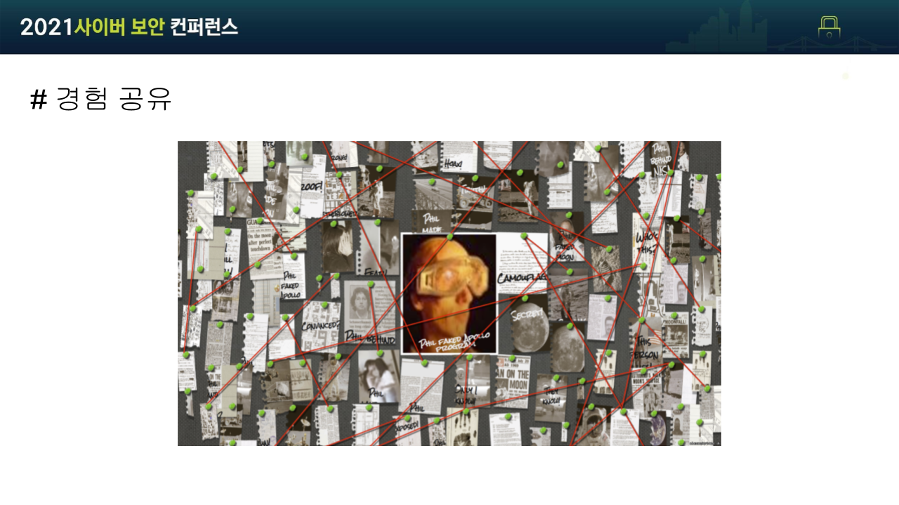

위 사진은 Crazy Wall이라 부르는 일종의 마인드멥입니다. 범죄 스릴러 영화나 마약 카르텔 영화 등에서 자주 보이곤 하는데 어떤 사건의 증거, 중심인물 등의 사진이 벽에 붙여 놓고 실로 연결 지어 새로운 단서가 될만한 사실이나 보이지 않던 연관관계를 찾기 위해 사용됩니다.

앞서 설명한 대로 RSS Crawler를 사용해 최신 이슈들을 따라다니다 보면 머릿속에 Crazy Wall이 그려지곤 합니다. 취약점들 사이의 연관관계가 보인다건가, 어떠한 취약점을 찾기 위해 사용된 방법을 조금 비틀어 다른 곳에 적용시켜보는 등의 아이디어가 떠오를 수 도 있습니다.

그리 대단하진 않지만 제 머리속에 그려졌던 Crazy Wall의 일부를 발췌해 이야기해볼까 합니다.

총 3가지 이야기를 통해 왜 RSS Crawler를 이용한 최신 이슈 트래킹이 보안 뉴비들에게 도움이 되는지 설명해보려 합니다.

첫 번째는 제가 첫 버그바운티 포상금을 받은 이야기입니다. 버그바운티를 할 때 취약점의 종류를 많이 알고 있는 것이 왜 중요한지 예시를 들어 설명하겠습니다.

두 번째는 중복 제보에 대한 이야기이고 다른 보안 연구원들의 취약점 탐색 아이디어를 얻어 시간과 노력을 효율적으로 사용하는 것에 대해 알아보겠습니다.

마지막으로 보안 커뮤니티의 다양한 의견을 보고 사고를 확장하게 된 경험을 공유하겠습니다.

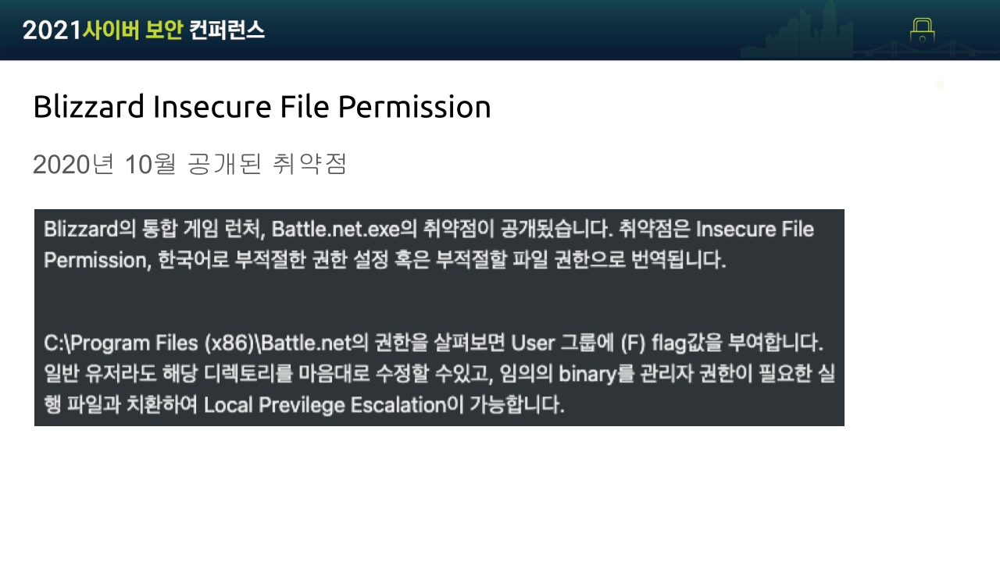첫 번째 이야기 입니다.

워게임은 정말 좋은 공부 수단이라 생각합니다. 지식 습득과 더불어 노력한 만큼 확실하고 즉각적인 성취감을 주는 공부법은 흔치 않죠. 워게임만큼 바로바로 성취감을 주는 공부방법도 없다고 생각합니다. 하지만 리얼월드는 조금 다르죠. 엄청난 노력을 쏳아 부어도 취약점을 찾으리란 확신이 없기 때문에 서서히 힘이 빠지게 됩니다.

하지만 시야를 조금만 넓혀본다면 이야기가 달라집니다. 뉴비라고 해도 쉽게 찾을 수 있는 취약점은 얼마든지 있으며 이를 통해 노력의 성과를 상대적으로 빠르게 보고 자신감을 키워나갈 수 있습니다.

예시로 들고온 취약점은 바로 Insecure File Permission입니다. 관리자 권한으로 실행되는 Blizzard 통합 게임 런처의 디렉터리의 ACL이 잘못 설정되어있던 취약점입니다.

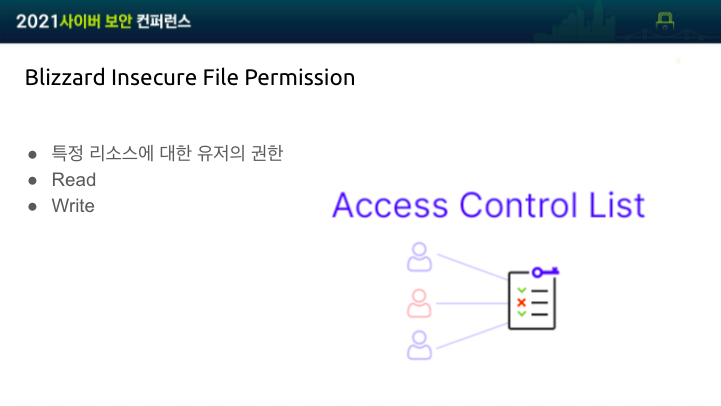

ACL(Access Control List)는 특정 object에 대한 유저나 그룹이 갖는 권한을 뜻합니다. 유저가 접근하면 안 되는 파일에 대한 접근 권한을 갖고 있으면 안 되겠죠? 악용될 가능성이 있는 파일의 접근 권한이 잘못 설정되어 있다면 Insecure File Permission 취약점입니다.

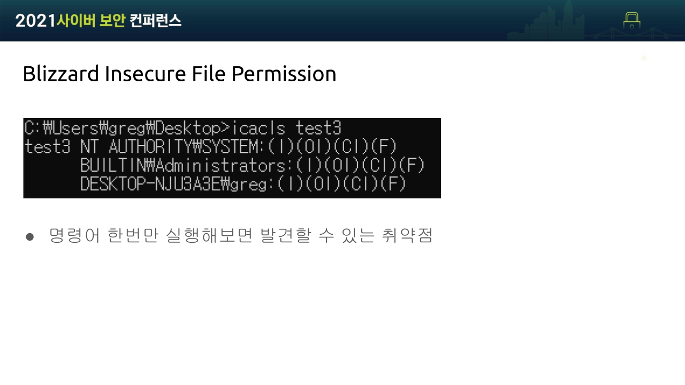

이 취약점 같은 경우에는 명령어만 몇 번 실행해보는 것으로 찾을 수 있습니다. 실제로 저는 Insecure File Permission 취약점으로 첫 버그바운티 포상금을 받았습니다. 여러분들도 이렇게 쉬운 취약점들부터 찾아가면서 리얼월드에 입문해보는 건 어떨까요?

두 번째 이야기 입니다.

사실 Insecure File Permission으로 첫 포상금을 받긴 했지만 제가 처음 제보한 취약점은 따로 있습니다. 이미지 뷰어에서 발생하는 memory corruption을 찾아서 시연 영상까지 깔끔하게 찍으며 정성스럽게 보고서를 작성했는데 듀플(Duplicate)처리되서 포상금을 못 받았습니다.

버그바운티에는 Duplicate Report(중복 제보) 시스템이 있습니다. 같은 취약점에 대해서 여러 번 제보가 들어온다면 가장 먼저 제보한 사람에게만 포상을 지급하는 시스템인데요. 그래서 버그바운티는 속도가 생명입니다. 취약점을 찾기 위해 소모하는 시간과 노력을 최대한 효율적으로 사용해야 한다는 말입니다.

서로 다른 취약점들의 연관관계에서 취약점 탐색 방법을 얻거나 다른 보안 연구원의 버그바운티 write-up에서 얻은 취약점 탐색 방법으로 얼마나 시간과 노력을 절약할 수 있는지 알아보겠습니다.

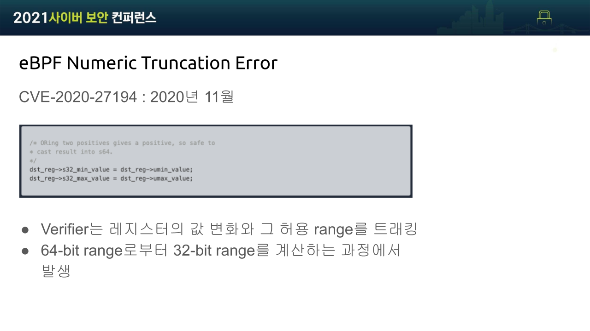

2020년 11월에 공개된 취약점입니다.

Linux kernel의 eBPF는 런타임 중 안전하게 커널 코드를 삽입하기 위해 Verifier와 BPF intruction을 사용합니다. 레지스터 값의 변화와 그 값들의 허용범위(이하 range)를 관리/감독하는 것으로 memory load와 store의 out-of-bound 여부를 검사합니다. 32-bit와 64-bit 각각의 range를 구분해 관리하는데 특정 BPF instruction 실행 후 range를 업데이트하는 과정에서 64-bit range로부터 32-bit range를 케스팅 하게 되고 일종의 overflow인 Numeric trucation Error가 발생하게 됩니다. 이 때문에 정상적인 out-of-bound 검사가 이루어지지 않는 취약점입니다.

2021년 5월에 공개된 취약점입니다.

CVE-2020-27194와 마찬가지로 eBPF Verifier에서 64-bit range로부터 32-bit range를 케스팅 하다 Numeric Truncation Error가 발생합니다. Verifier는 잘못된 레지스터 허용 범위를 추적 되고 이를 통해 해커는 out-of-bound read/write access가 가능해 로컬 권한 상승을 할 수 있습니다.

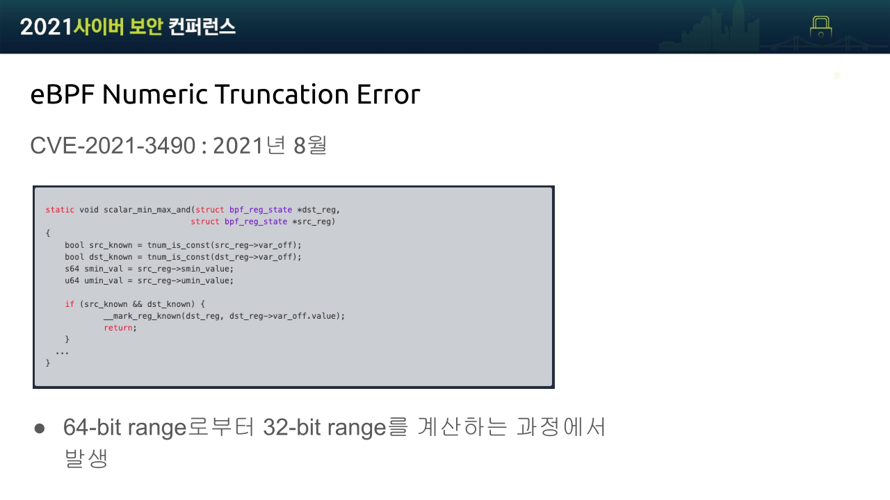

2021년 8월에 공개된 취약점 입니다.

이 또한 마찬가지로 eBPF Verifier에서 잘못된 케스팅으로 인해 발생하는 Numeric Truncation Error입니다. 32-bit range를 갖는 레지스터와 64-bit range를 갖는 레지스터끼리의 Bitwise 연산(BPF_AND, BPF_OR, BPF_XOR)이 끝난 후 그에 맞게 32-bit range를 업데이트 하는 과정에서 오류가 발생해 out-of-bound read/write를 할 수 있습니다.

방금 설명드린 세 취약점 모두 eBPF Verifier의 비슷한 기능들에서 발생하는 취약점들입니다. 이렇게 같은 프로그램의 비슷한 기능에서 동일한 취약점이 발견되는 경우도 있고, 비슷한 프로그램에서 비슷한 취약점이 발견되는 경우도 있습니다. 실제로도 CVE와 그에 대한 write-up이 공개되면 한동안 비슷한 취약점들이 우르르 쏟아지기도 합니다. 만약 여러분들이 2020년 11월에 공개된 CVE-2020-27184를 보고 eBPF Verifier의 비슷한 기능들을 분석해 봤다면 CVE-2021-3440, CVE-2021-3490을 찾아서 포상금을 받았을 수 도 있겠죠?

최근에 공개된 취약점 write-up을 보고 그대로 다른 곳에 적용해보는 게 맨땅에 해딩하는 것보다 시간과 노력 측면에서 이득입니다.

또한 최근에 공개된 버그바운티 Write-up을 보는 것은 취약점 탐색 기법 아이디어를 얻는 좋은 방법입니다. `SetSecurityFile()`의 race condition 문제로 인해 Windows Installer는 취약점 패치와 패치 우회가 반복된 적이 있습니다. 해당 취약점을 제보한 연구원은 자신의 블로그에 6번째 bypass를 찾았다며 짜증내는 글을 작성했습니다. 패치 전 버전과 패치 후 버전의 차이점을 뽑아내는 Patch Diffing 기법을 사용해 패치된 코드만을 분석해 빠르게 취약점을 찾았습니다. 아무렇게 타겟을 정하고 되는대로 분석을 하며 버그를 찾는 것보다 훨씬 수월하게 취약점을 찾을 수 있겠죠?

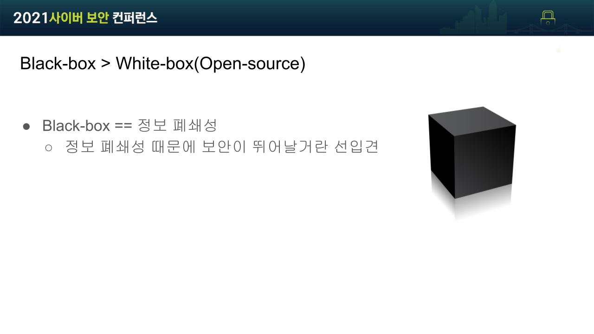

세 번째 이야기입니다.

일반적으로 Black-box가 오픈소스보다 분석하기 어렵기 때문에 보안상 더 안전할 것이라는 인식이 있습니다. 저도 그렇게 생각하는 사람 중 한 명이었고요. 하지만 보안 연구원들 사이에서 black-box라고 오픈소스보다 분석이 특별히 어려운 게 아닐 뿐더러 꼭 보안상 더 안전한 건 아니라는 의견이 있습니다. 여러분들은 어떻게 생각하시나요? 2개의 사건을 통해 저는 어떤 입장을 취하게 됐는지 설명하겠습니다.

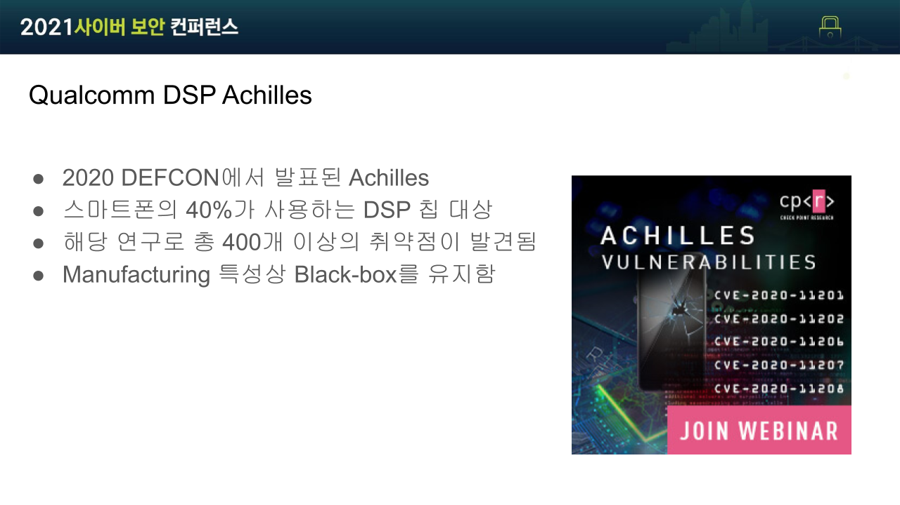

Checkpoint Research는 2020년 Defcon에서 Achilles라는 연구 논문을 발표했습니다. Achilles는 Qualcomm DSP( Digital Signal Processor ) 칩에서 400개 이상의 취약점을 찾은 퍼징 기술 연구입니다. Qualcomm은 다양한 칩들을 생산하는 회사로, 스마트폰 시장의 40%가 Qualcomm의 칩을 사용하고 있기 때문에 다수의 취약점이 발견되자 큰 이슈가 됐었죠.

DSP 칩들은 기본적으로 Black box로 관리되기 때문에, manufacturer가 아니라면 DSP 칩에 대한 정보가 제한적일 수밖에 없습니다. 이 칩을 사용해 스마트폰을 만드는 제조사도 예외는 아닙니다. Checkpoint는 black box 때문에 스마트폰 제조사들이 신속하게 이슈를 고치지 못하는 상황을 지적하며 Achilles 연구가 성공한 이유라고 언급했습니다.

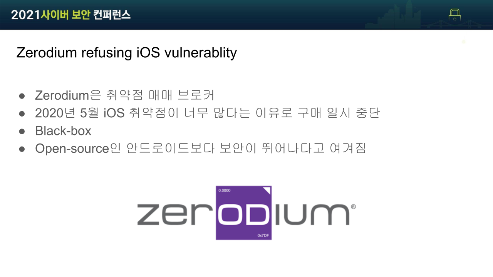

2020년 5월 취약점 매매 브로커인 Zerodium이 ios exploit의 제보가 너무 많다는 이유로 임시 구매 중지를 선언했습니다. Open source인 Android 보다 취약점 제보 건수가 많다는 것을 근거로 Closed source(black box)를 유지하던 ios의 보안성은 더 이상 효과 없다는 의견이 있습니다.

Qualcomm DSP와 iOS 모두 black-box이지만 과하다 싶을 정도로 많은 취약점이 발견되어 이슈가 되었습니다. Qualcomm의 사례처럼 black-box를 분석하는 방법론들이 활발히 연구되고 있고 iOS의 사례처럼 많은 사람들이 오랜 기간 분석하다 보니 black-box의 정보 폐쇄성 효과가 점점 옅어지고 있다고 생각합니다. Black-box가 오픈소스보다 분석하기 어렵고 보안상 안전하다는 말이 사실인지는 여전히 토론의 여지가 있지만 반례가 조금씩 나오고 있는 현재로써는 꼭 Black-box라고 더 보안이 뛰어난 것은 아니라고 말하고 싶습니다.

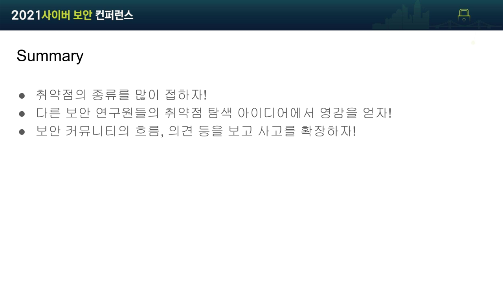

보안 입문자라면 RSS Crawler를 이용해 최신이슈를 접하면서 다음과 같은 효과를 보시기 바랍니다.

1. 취약점 종류를 많이 접하고 자신감을 얻자!
2. 취약점 탐색 아이디어를 얻어 시간과 노력을 효율적으로 사용하자!
3. 보안 커뮤니티의 흐름과 의견을 통해 사고를 확장하고 가치관을 세우자!

저희와 함께 최신 보안 이슈들을 팔로업하며 공부하고 싶으신 분들은 Hackyboiz 페이스북 메세지로 언제든지 연락주세요.