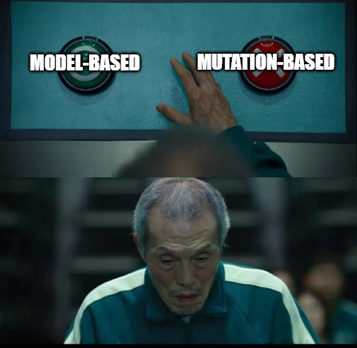

# 머릿말


안녕하세요. Fabu1ous입니다.

저번 Part 2에선 퍼징 알고리즘의 6단계인 Preprocess, Schedule, InputGen, InputEval, ConfUpdate, Continue 중 Preprocess와 Schedule을 알아봤습니다. 이번 Part 3에선 현재 iteration에 적용시킬 input을 생성하는 InputGen 단계를 알아봅시다.


# 5 Input Generation

```
InputGen(conf) → tcs
```



test case의 내용이 bug trigger에 직접적인 영향을 미치기 때문에 Input generation에 사용되는 기술은 퍼저의 디자인 선택에 가장 큰 영향을 줍니다. 퍼저는 크게 generation-base, mutation-base 두 개로 나뉩니다. Generation-based는 PUT의 expected input에 대한 model을 통해 input을 생성하기 때문에 model-based fuzzer라고도 부릅니다. mutation-based는 제공된 seed를 Mutate(변조) 시켜 input을 생성합니다. Seed가 expected input space를 대표할 수 없기 때문에 model-less fuzzer라고 부릅니다.


## 5.1 Model-based

model-based는 PUT의 expected input space를 설명하는 model로부터 test case를 생성합니다.

예를 들면 input format을 설명하는 문법이라던가 파일 타입을 지칭하는 magic value 등이 model이 될 수 있습니다.


### 5.1.1 Predefined Model

다양한 종류의 Model-based 퍼저 들이 존재합니다. 그중 사전 정의된 모델이나 유저로부터 모델을 제공받는 퍼저들이 있습니다.

Peach, PROTOS, Dharma는 유저로부터 모델에 대한 상세정보를 전달받아 퍼징에 사용합니다. Autodafe, Sulley, SPIKE, SPIKEfile은 분석이 허용된 API로 부터 스스로 input model을 만들고,  Tavor는 Extended Bakcus-Naur Form(EBNF)에 적힌 input의 상세 정보를 받아 test case를 만듭니다. 네트워크 프로토콜 퍼저들 PROTOS, SNOOZE, KiF, T-Fuzz는 프로토콜의 상세 정보를 유저로부터 받습니다. Kernel API 퍼저들은 시스템 콜 탬플릿의 형태를 띄는데 이런 탬플릿은 주로 특정 system call이 기대하는 arguments의 수와 타입을 명시합니다.

다른 model-based 퍼저는 특정 문법이나 언어를 모델로 사용합니다. 이런 언어 모델은 퍼저 내에서 만들어집니다. 예를 들면 cross_fuzz와 DOMfuzz는 랜덤 Docutment Object Model (DOM) objects를 생성합니다. 비슷하게 jsfunfuzz는 문법에 맞는 랜덤 JavaScript 코드를 문법 모델에 생성하고 QuickFuzz는 test case를 생성할 때 파일 포멧을 설명하는 Haskell library 사용합니다. TLS와 NFC 같은 특정 네트워크 프로토콜 모델을 사용하는 TLS-Attacker, tlsfuzzer, llfuzzer도 있습니다.

LangFuzz는 input으로 받은 seed들을 파싱 해 code 조각을 생성, 생성된 조각을 랜덤으로 조합해서 seed를 mutate 시켜 testcase 생성합니다. 문법을 통해 생성하기 때문에 항상 syntax가 정상적인 코드를 생성하는데 js나 php에 적용할 수도 있습니다.

BlendFuzz는 LangFuzz와 비슷한 방식으로 xml을 모델로 사용합니다.


### 5.1.2 Inferred Model

최근엔 사전 정의된 모델이나 유저로부터 제공받는 모델에 의존하는 대신 infer model을 사용하 사례도 있습니다. 모델 추론은 instrumentation과 동일하게 Preprocess나 ConfUpdate 단계에서 진행됩니다.

5.1.2.1 Model inference in Preprocess

TestMiner는 literal 값을 통해 정상적인 input을 예측합니다.

Skyfire는 시드들과 문법을 사용한 data-driven 방식으로, Probabilistic context-sensitive grammer를 추론하고 새로운 시드를 만드는데 사용됩니다. semantic이 유효한 input을 생성하는데 집중합니다.

IMF는 system API log를 분석해 kernel API 모델을 학습하고 특정 시퀀스의 API를 호출하게 만드는 C 코드를 생성합니다.

CodeAlchemist는 "code brick" 단위로 JavaScript를 분해 그에 대응하는 어셈블리를 계산하고 인접한 brick끼리의 분리와 병합이 의미상으로 유효한지 검사합니다.

Neural과 Learn&Fuzz는 신경망 기반 머신 러닝을 통해 주어진 test file로 모델을 학습하고 test case를 생성합니다.

5.1.2.2 Model inference in ConfUPDATE

Preprocess 단계가 아니라 매 iteration이 끝날 때마다 모델을 업데이트하는 방식도 있습니다. PULSAR는 캡쳐한 network packet을 통해 network protocol을 추론하고 이를 퍼징에 사용합니다. state machine을 사용해 각 state와 message를 mapping 하고 이를 나중에 test case 생성에 사용합니다.

비슷한 방식으로 I/O 행위를 관찰해 웹 서비스를 추론하는 state machine 아이디어가 제시되기도 했습니다. GLADE는 PUT을 퍼징 하기 위해 I/O 샘플들로부터 context-free grammer를 합성해서 만들어진 inferred 문법을 사용합니다.

go-fuzz는 grey-box fuzzer로 seed pool에 seed가 추가될 때마다 모델을 빌드합니다. 이 모델은 새로운 seed를 생성하는데 사용됩니다.


### 5.1.3 Encoder Model

퍼징은 특정 파일 포멧을 파싱 하는 디코더 프로그램에 자주 사용됩니다. 여러 파일 포멧들은 저마다 인코더 프로그램이 존재하고 이는 해당 파일 포멧의 절대적인 모델이라 말할 수 있습니다.

MutaGen은 이러한 인코더 프로그램에 담긴 절대적인 모델을 사용해 새로운 test case를 생성하는 퍼저입니다. 다른 뮤테이션 기반 퍼저들과의 차이점은 test case를 mutate 해 새로운 test case를 만드는 것이 아니라 인코더 프로그램을 mutate 한다는 것입니다. 전체 프로그램에서 일부만 실행시키면 당연히 프로그램의 동작이 달라질 거라는 아이디어에서 출발해 실행 가능한 인코더의 조각을 실행합니다.


## 5.2 Model-less Fuzzer (mutation-based fuzzer)

고전적인 랜덤 테스트는 특정 path 상황을 만족하는 test case를 생성하는데 한계가 있습니다. if (input == 42)라는 C 구문이 있다고 가정하면 input이 32-bit integer라고 할 때 랜덤 하게 input을 정해 맞출 확률은 1/2^32입니다. MP3 파일처럼 잘 짜여진 input의 경우, 상황은 더욱 안좋겠죠? 의미 있는 시간 내로 온전한 mp3파일을 랜덤 생성한다는 것은 말이 안 됩니다. 즉, 랜덤 테스트로는 타겟 프로그램의 파싱 단계보다 더 깊숙한 path에 도달하기 힘듭니다. 그래서 seed-based 인풋 생성과 white-box 인풋 생성을 사용합니다. 대부분의 Model-less 퍼저는 PUT의 인풋이 되는 seed를 변조해 test case를 생성합니다. 파일, 네트워크 패킷, UI 이벤트 시퀀스 등이 seed로 쓰일 수 있습니다. seed의 일부만을 변조하는 것으로 유효하면서도 crash 등을 발생시킬 비정상적인 값을 포함한 input을 만들 수 있습니다.

seed를 Mutate 하는 다양한 방법이 있습니다.


### 5.2.1 Bit-Flipping

bit-flipping은 많은 model-less 퍼저에서 사용되는 보편적인 기술입니다. 고정된 길이의 bit를 flip 하거나 flip할 길이를 랜덤으로 정할 수도 있습니다. 몇몇 퍼저들은 seed를 mutate 할 때 mutation-ratio와 같은 user-configurable parameter를 받아 InputGen 한번 당 flip할 비트 수를 정하기도 합니다. 예를 들어 N-bit 크기의 seed에서 K-bit 만큼 랜덤 하게 flip 할때 mutation-ratio는 K/N이 됩니다. SymFuzz는 퍼징 효율은 이 mutation-ratio에 민감하다는 것을 보여줍니다. 모든 PUT에 적합한 ratio 따윈 없는데, 그렇다면 좋은 mutation-ratio를 찾는 방법은 뭐가 있을까요?

BFF와 FOE는 mutation-ratio 집합의 지수 분포를 통해 통계적으로 효율적인 ratio에 더 많은 iteration을 할당합니다.

SymFuzz는 white-box 프로그램 분석을 통해 각 시드별 적절한 mutation-raito를 추론하고 사용합니다.


### 5.2.2 Arithmetic Mutation

AFL과 honggfuzz는 mutate 할 바이트를 선택해 integer로 취급하고 산술 연산을 통해 해당 바이트를 변조합니다. 이때 mutation의 영향을 제한하는 것이 핵심입니다. 예를 들면 AFL은 seed에서 4byte를 선택해 랜덤 생성된 integer와 덧셈 혹은 뺄셈을 해서 mutate 합니다. 이 랜덤 생성되는 integer의 범위는 fuzzer마다 다르고 user-configurable 값인 경우도 있습니다. AFL의 경우엔 이 범위가 0~35입니다.


### 5.2.3 Block-based Mutation

몇 가지 block-based mutation 방법론이 존재합니다. block은 seed의 byte 시퀀스를 의미합니다.

1. 블록을 seed의 임의 위치에 삽입
2. seed에서 임의의 블록을 삭제
3. seed에서 임의의 블록 교체
4. 여러 블록의 순서를 재배치
5. 임의의 블록 크기 resize 및 새로운 블록 첨가


### 5.2.4 Dictionary-based Mutation

의미 가중치가 높은 상수값을 사용하는 퍼저도 존재함. 예를 들면 0 혹은 -1, 포멧 스트링 등이 mutation의 대상이 된다. AFL과 honggfuzz, libfuzzer는 0과 -1, 그리고 1등의 값을 사용해 Integer를 mutation 합니다. Radamsa는 unicode를 사용하고, GPF는 %x, %s 등 포멧 문자를 사용해 문자열을 mutate합니다.


## 5.3 White-box Fuzzers

white-box fuzzer 또한 model-based와 model-less로 분류할 수 있습니다. 예를 들면 dynamic symbolic execution과 mutation 기반 퍼저는 모델이 필요 없습니다. 하지만 일부 symbolic executor는 input grammer로 symbolic executor를 가이드하는 등 input model을 활용하기도 합니다. 많은 white-box 퍼저들이 test case를 생성하기 위해 dynamic symbolic execution을 사용하지만, 모든 white-box fuzzer들이 dynamic symbolic executor인 것은 아닙니다. 일부 퍼저들은 white-box 프로그램 분석을 통해 PUT이 수용하는 input에 대한 정보를 얻어 이를 통해 black-box, grey-box 퍼징을 수행하기도 합니다.


### 5.3.1 Dynamic Symbolic Execution

high level에서의 고전적 symbolic execution은 모든 가짓수의 input을 의미하는 미지수를 통해 프로그램을 실행하는 것입니다. PUT을 실행하면서 상수값을 평가하는 대신 symbolic expression을 빌드합니다. 조건 분기문에 도달할 때마다 두 개의 sybolic interpreter를 for k합니다. 하나는 true, 다른 하나는 false branch에 도달합니다. 그리고 모든 path마다 sybolic interpreter는 path formula를 빌드합니다. 하나의 concrete input이 원하는 path에 도달하면 path fomula는 적합하다고 판단합니다. SMT solver에 path fomula에 대한 해답을 요청하는 것으로 concrete input을 생성할 수 있습니다. Dynamic symbolic execution은 symbolic execution과 concrete execution이 동시에 진행된다는 점에서 전통적인 symbolic execution과 차이가 있습니다. 그래서 dynmaic symbolic execution을 concolic ( concrete + symbolic ) testing이라고도 부릅니다. 핵심 아이디어는 concrete execution state가 symbolic constraints의 복잡도를 감소하는데 도움이 된다는 것입니다. 퍼징 말고도 dynamic synbolic execution는 여러 곳에 적용 되고 있습니다.

Dynamic symbolic exection은 PUT의 모든 Instruction 하나하나 instrument 하고 분석해야 하기 때문에 grey-box, black-box 보다 느립니다. 이런 높은 비용을 감당하기 위해 좁은 범위에만 사용하는 전략이 대표적입니다. 예를 들면 유저가 특정 코드를 적용 범위에서 제외시킨다던가, grey-box 퍼징과 concolic testing을 번갈아가며 사용할 수 있습니다. Driller와 Cyberdyne은 빠른 concolic execution engine을 구현해 grey-box와 white-box 퍼징을 합쳤습니다. DigFuzz는 grey-box와 white-box퍼징을 교대하며 사용하는 방식을 최적화했는데, 우선 grey-box로 각 path 별 도달 확률을 계산하고, 그중 grey-box로 도달하기 가장 힘든 path들은 white-box가 공략합니다.


### 5.3.2 Guided Fuzzing

일부 퍼저들은 정적 분석과 동적 분석 기술을 통해 퍼징의 효율을 높입니다. 이런 기술들은 두 단계를 거치는데, 다음과 같습니다.

1. PUT에 대한 정보를 얻는 비용 높은 작업
2. 이전 단계로부터 얻은 정보를 토대로 test case를 생성

TaintScope는 fine-grained taint analysis를 통해 치명적인 system call이나 API에 흘러들어 가는 데이터, "Hot bytes"를 찾습니다.

Dowser는 컴파일 도중 정적 분석을 통해 heuristic 상 버그를 포함하고 있을 만한 loop(예를 들면 Pointer derefernce를 포함한 loop)를 찾습니다. 그리고 taint analysis를 통해 input bytes와 loop들 사이의 관계를 계산합니다. 마지막으로 ciritical bytes만을 symbolic으로 만들어 dynamic symbolic execution을 수행합니다.

VUzzer와 GRT는 input generation을 가이드하기 위한 PUT의 data-flow정보를 얻기 위해 정적 분석과 동적 분석 둘 다 사용해 얻습니다.

Angora 와 Read Queen는 처음엔 높은 비용을 지불하며 instrumentaion을 수행하고 Input을 생성합니다. 여기서 얻은 정보를 토대도 서서히 instrumentation의 비용을 줄이고 hot bytes 아이디어를 수용해 taint analysis를 사용합니다.


### 5.3.3 PUT Mutation

Fuzzing을 실용적인 문제 중 하나는 바로 checksum 검사를 통화하는 것입니다. 예를 들면 PUT이 input을 파싱 하기 전에 checksum을 계산한다면 PUT은 많은 수의 test case를 거부할  것입니다. 이 문제를 해결하기 위해서 TaintScope는 checksum-aware fuzzing 기술을 제안합니다. taint analysis를 통해 checksum test instruction을 구별하고 PUT의 코드를 패치해 checksum 검사를 우회할 수 있습니다. 만약 crash를 찾았다면 코드 패치 전 PUT의 올바른 checksum을 계산해 Input을 수정합니다. T-Fuzz는 grey-box 퍼징을 통해 어떠한 종류의 조건부 branch라도 통과할 수 있습니다. 우선 NCC (Non-Critical Cehcks: 프로그램의 로직에 영향을 주지 않고 패치할 수 있는 branch들)를 빌드합니다. fuzzing campaign이 새로운 Path를 더이상 찾지 못하면 NCC를 하나 선택해 PUT을 변조하고 fuzzing을 재개합니다.


# 마치며


이번 파트에서 InputGen 뿐만 아니라 InputEval 단계까지 다룰 예정이었으나 아쉽게도 InputGen까지만 작성하게 되었습니다. 저만이 아니라 요즘 hackyboiz 팀원 모두가 정신없이 살고 있습니다. 왜 연말만 되면 바쁜 걸까요? 아무튼 다음 Part에선 나머지 InputEval, ConfUpdate, Continue를 다루고 시리즈를 마무리하려고 합니다!