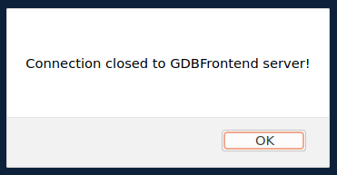
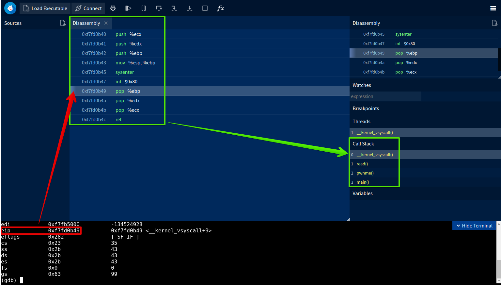
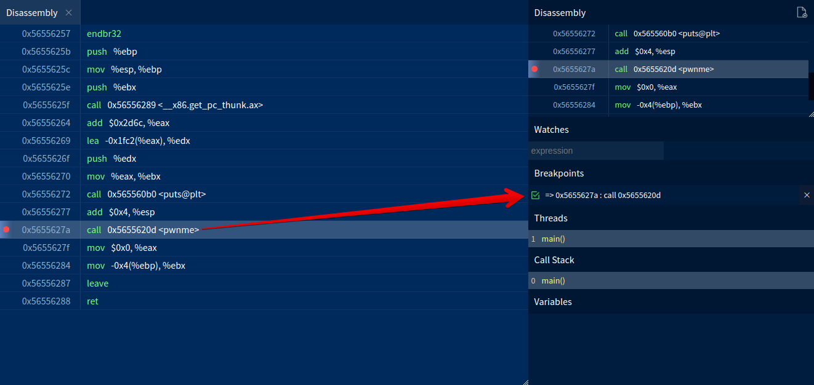
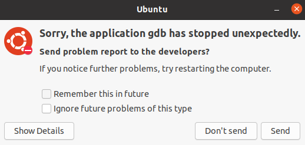

# 5개월 묵힌 링크


몇 달 전 Fandu형님이 직접 사용해보고 후기를 알려달라는 말과 함께 링크를 하나 던져주셨습니다. 할 일도 묵혀둬야 제맛! 5달 동안 고이 모셔놓은 GDBFrontend, 똥인지 된장인지 찍어 먹어 봅시다.


# 설치 및 실행

[rohanrhu/gdb-frontend](https://github.com/rohanrhu/gdb-frontend)

```bash
git clone <https://github.com/rohanrhu/gdb-frontend.git> gdb-frontend
cd gdb-frontend
./gdbfrontend
```

공식 github에 나와 있는 설치 방법입니다. 터미널 키시고 그대로 입력하시면 되겠습니다.

1. GDB 8.2 이상
2. python3
3. tmux

gdb-frontend를 사용하기 위한 요구사항은 3가지가 있는데, 지금 저의 환경은 Ubuntu 20.04이므로 tmux만 추가로 설치해주면 환경 세팅은 끝입니다.


gdb-frontend를 실행시킨 후 브라우저로 [`http://127.0.0.1:5551/terminal/`](http://127.0.0.1:5551/terminal/)에  접속해주시면 됩니다. `-w` 옵션으로 working directory도 설정해 줄 수 있습니다.


# 파이어 폭스는 나가있어




만약 파이어폭스를 쓰고 계신다면 다른 브라우저를 사용하셔야 합니다. gdb-frontend server와의 연결이 계속 끊기길래 원인을 찾느라 시간 낭비를 좀 많이 했습니다. 자주 애용하는 gdb 플러그인 pwndbg와의 충돌이 문제라 생각해 pwndbg도 지워보고, 아예 VM을 새로 생성해 처음부터 다시 환경 구축해봤지만 결국 파폭과의 호환 문제였네요...


[tmux.conf invalid settings problem · Issue #5 · rohanrhu/gdb-frontend](https://github.com/rohanrhu/gdb-frontend/issues/5)


# gui 훑어보기

```bash
$ ./gdbfrontend -w /home/fabu1ous/Desktop/
GDBFrontend v0.3.0-git
Listening on 127.0.0.1: <http://127.0.0.1:5551/>
Open this address in web browser: <http://127.0.0.1:5551/terminal/>
```

브라우저로 접속한 [`http://127.0.0.1:5551/terminal/`](http://127.0.0.1:5551/terminal/)의 화면은 gdb shell이 띄워진 terminal과 gui 부분으로 나뉩니다. terminal 부분은 gdb와 다를 게 없으니 넘어가고, gui의 기본적인 구성과 기능 중 제가 써보면서 좋다고 느낀 점들을 써보겠습니다.

[ ! ] 개발자의 관점에서 디버거를 써본 적이 단 한 번도 없으니 유의하세요.




함수 별로 assembly 코드로 출력해주며 다음에 실행될 인스트럭션은 연한 색으로 하이라이트 됩니다. 그중에서도 Call Stack 0번에 나타나는 함수의 하이라이트 된 부분은 eip (혹은 rip)입니다. 현재 프로그램 흐름의 위치를 대단히 직관적으로 알 수 있습니다. 글재주가 없어서 이렇게밖에 설명을 못 하겠네요. ㅎㅎ




break point는 instruction의 주소를 클릭해서 생성 혹은 삭제할 수 있습니다. 좌측에 break point들의 목록을 보여주며 체크박스로 활성화 여부를 변경할 수 있습니다. 기존에 사용하던 pwndbg에서 가장 아쉬웠던 점이 바로 break point 관리가 번거롭다는 것인데, gdb-frontend는 GUI로 이 기능을 제공하니 상대적으로 좀 더 편리합니다.


# 쓸 가치가 있는가?

확장성이 좋다는 점을 내세우고 있는 만큼 설명할게 많진 않네요.

위에서 설명한 것들을 제외하면 대부분의 기능을 gdb에 의존하고 있고, 그냥 gdb만 사용하는 것과 크게 다르다는 느낌은 받지 못했습니다. gdb를 써보신 분들은 아시겠지만 gdb만을 사용해서 디버깅하는 변태는 없습니다. 적어도 해킹 씬에는 없을 거야. 메모리나 register값의 변화에 집중하며 디버깅하는 저에게 instruction 하나 실행할 때마다 `info reg` 같은 명령어를 입력하라고 한다면... 어후...

그런 점을 gdb-frontend가 개선해주진 않습니다. UI가 이쁘긴 하지만 저에게 필요한 부분은 구현이 안돼 있으니 '이쁜 쓰레기'라는 단어는 이럴 때 쓰는 말 이겠죠. 정작 Disassembly는 화면에 두 번이나 출력해줍니다. ㅎㅎ

> L0ch 曰 : 이쁜 쓰레기네 이쁜 쓰레기


gdb-frontend로 CTF문제 하나 풀고, 연구 글을 가장한 write-up을 작성하려 했지만 도저히 gdb-frontend만으로 문제를 풀 순 없을 거 같네요. 그래서 일말의 희망을 갖고 pwndbg와 연동해봤습니다만, gdb-frontend는 주객전도를 허용하지 않습니다. gdb-frontend의 ui가 없어질 정도로 terminal의 크기를 키워야 하고,




무엇보다 gdb-frontend가 뻗어버립니다. 일단 제가 사용하면서 crash 나는 상황은 2가지 있었습니다.

1. 분석하고 있는 프로세스가 segmentation fault를 일으킬 때
2. 존재하는 프로세스에 attach 할 때

저에겐 이 두 가지 상황 모두 매우 큰 단점입니다. python exploit 코드에 따라 동작하고 있는 프로세스에 gdb를 attach 해 분석하는 것이 주된 사용방법인데, 그게 안된다니요... 그리고 segmentation fault에 대한 어떠한 정보도 얻을 수 없으니 취약점 찾는 입장에선 화딱지가 안 날 수가 없습니다.


# 마무리

1. gdb의 기능을 gui로 사용할 수 있다? **No**
   * 결국 모든 동작은 gdb terminal을 통해 이루어짐.
   * gui로 gdb를 다루는 것이 아니라, gdb의 결괏값을 gui로 보여주는 플러그인
   * chrome으로 gdb를 사용하는 거라 오히려 불편함
2. pwnable에 사용할 수 있다? **No**