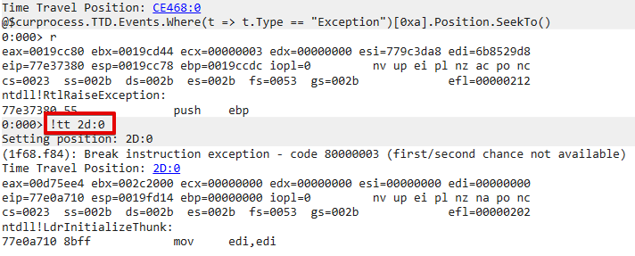
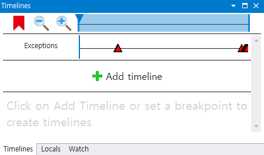
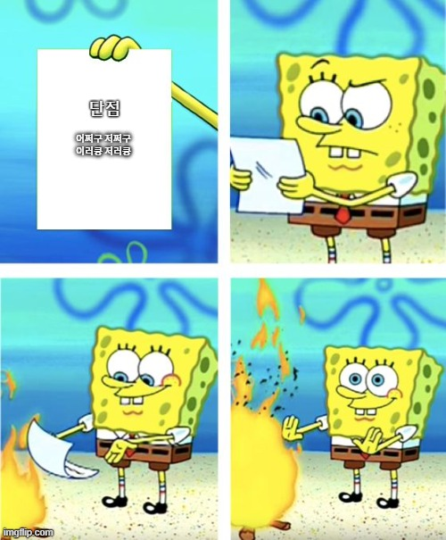

# 머릿말

Time Travel Debugging(TTD)는 2017년에 공개된 Windbg preview의 기능입니다. 공개된 지 3년이나 지났지만 아직 한글로 된 자세한 문서는 별로 없는 거 같더라고요. windbg preview를 쓴다거나 TTD의 존재를 아는 사람이 적어서 그런가 싶기도 하고... windbg로 디버깅을 처음 해본다거나 디버깅 자체를 처음 시작하려는 사람들에겐 한글로 된 문서가 문턱의 높이를 낮추는데 큰 도움이 된다고 생각합니다.

그래서 "내가 만들어 보지 뭐"라는 생각으로 직접 공부해보면서 작성해볼까 합니다.

대략 Part 3까지 생각 중이고, Part 4까지 추가로 할 수도 있어요.

- Part 1 : 간단 소개 및 첫인상
- Part 2 : 구버전의 open source에서 발생하는 버그를 직접 분석해보는 실습
- Part 3 : 크래쉬 분석에 사용해본 경험담
- Part 4 : JavaScript를 이용한 자동화 및 고오오급 사용법

# Time Travel Debugging

불현듯이 과거에 저지른 실수 때문에 이불 킥을 하고 싶은 경험을 누구나 한 번쯤은 해봤을겁니다. 과거로 돌아가 모두 없던 일로 만들 수만 있다면 얼마나 좋을까요. 물론 그게 불가능하다는 사실이 더욱 가슴을 후벼 파며 사람을 미치게 만듭니다. 하지만 Microsoft의 Debugging Experience팀은 Debugging의 한에선 과거로 돌아가 저지른 실수를 만회할 수 있게 해 줍니다.

> Time Travel Debugging(TTD), is a tool that allows you to record an execution of your process running, then replay it later both forwards and backwards.

TTD는 프로세스의 실행을 "되감기(rewind)"할 수 있기 때문에 매번 버그를 재 구현하는 번거로움을 덜고 디버깅할 수 있습니다. 게다가 MS 스토어에서 windbg preview를 설치하는 것만으로 TTD를 사용할 수 있다니...

아니아니 무료라구요 손님

# 기본적인 사용법

## 관리자 권한으로 실행

디버깅 타겟의 실행을 녹화해 만들어진 Trace file(이하 `.run`)을 씹고 뜯고 맛보고 즐긴다는 게 TTD의 매력입니다. 그전에 우선 windbg preview를 관리자 권한으로 실행하셔야 합니다. Input/Output 트레이싱을 기록하는 디버깅 방식은 이미 존재해왔지만 TTD는 이보다 좀 더 확장된 개념으로, 프로세스의 모든 실행을 기록해 `.run`을 만들기 때문에 상대적으로 높은 권한을 요구합니다.

## Trace file 녹화하기

[상단 메뉴] > [파일] > [Launch executable (advanced)] > 실행 파일 선택 > [Record with TTD 체크 박스]

디버깅 타겟이 될 실행 파일을 선택해준 뒤 Record with Time Trabel Debugging를 체크해주시면 됩니다.

기본적으로 `.run`파일은 `C:\\Users\\username\\Documents`에 만들어집니다. 원하신다면 생성 경로를 바꾸실 수 있습니다. `.run`파일의 경로를 지정 후 Record 버튼을 누르시면 프로세스의 녹화가 시작됩니다.

타겟의 녹화가 진행되고 있음을 알려주는 팝업창이 뜬다면 정상적으로 녹화되고 있다는 뜻입니다. 이 팝업창에선 타겟 프로세스, 녹화 커멘드를 보여주며 이 녹화가 진정 내가 원하는 녹화가 맞는지 최종 확인하시면 됩니다.

물론 이 팝업창이 뜬다면 그런 건 신경 쓰지 마시고 최대한 빨리 디버깅하고자 하는 이슈나 버그를 재현해주셔야 합니다. 나중에 잠시 다룰 단점의 내용이지만 간단히 설명드리자면  `.run`파일이 크기가 생각보다 빨리 커집니다. 이 글을 쓰기 위해 재현하는데 대략 3~4초 정도 걸리는 크래쉬를 녹화했고 1.5GB 크기의 `.run`파일이 만들어졌습니다. 평균적으로 영화 한 편이 1.5GB입니다. 거기다 추가로  `.idx`라는 파일이 0.5GB를 차지하니 총 2GB나 사용하는군요. MSDOCS에 따르면 `.idx`파일은 보통  `.run`파일의 2배 정도의 크기가 된다고 합니다.

앞으로 이 `.run`파일만 있다면 디버깅을 하다가 다시 버그를 재현하는 번거로움을 없앨 수 있습니다. 보통 디버깅하다 실수한다거나 컨트롤이 버그 발생시점을 넘어가버리면 restart기능을 사용해 프로세스의 시작 시점으로 돌아가야 합니다. 간혹 restart기능이 안 먹거나 디버거 자체를 재시작해야 하는 경우엔 버그를 또다시 재현해야 해서 상당히 귀찮죠. 저는 이런 경우에 vm의 스냅샷을 이용하거나 `.bat`파일을 사용해 버그 재현을 자동화 하곤 했습니다. 우웩...

# TTD 쓰세요, 두번 쓰세요

지금까지 간단하게 TTD를 사용해본 제가 생각하는 장점, 그리고 MS에서 내세우고 있는 장점을 알아봅시다.

## Re:zero부터 시작하는 디버깅? 우웩

아까 말씀드린 대로 디버깅하면서 프로세스의 시작 시점으로 돌아가는 일은 정말 빈번히 발생합니다. 이래서 우리 idioth형이 리버싱을 좋아하나 봐요. ㅋㅋㅋㅋ

디버거 종류와 상관없이 조금 만져봤다 하시는 분들은 위 사진에서 각각 기능들이 무슨 동작을 하는지 익숙할 겁니다.

1. GO : break point 위치까지 프로그램을 실행
2. Step Out : 현재 함수를 끝까지 실행 후 리턴
3. Step Into : instruction 한개 실행, 만약 함수를 호출하면 함수 내부로 진입
4. Step Over : instruction 한개 실행, 만약 함수를 호출하면 해당 함수를 끝까지 실행후 리턴

GO를 진행하기 전에 break point 설정을 잘못했다거나, Step Into를 사용해 함수 내부로 진입해야 하는 상황에서 Step Over를 하게 될 경우 눈물을 머금고 restart버튼을 눌러야 하죠. 정말 잠시 집중을 안 하면 벌어지는 일이라 짜증 나기도 하고 break point의 한계를 생각해보면 여간 귀찮은 게 아닙니다. TTD는 이런 불편함을 어떻게 해결했을까요?

## Reverse Flow Control

TTD는 위에서 설명한 Flow Control 기능을 뒤집은 Reverse Flow Control을 제공합니다. 그냥 말 그대로 프로그램의 흐름을 거꾸로 거슬러 올러갈 수 있다는 뜻입니다. 아까 말한 대로 Step Into를 해야 할 상황에서 Step Over를 해버려서 분석해야 할 함수에 진입하지 못했다면 단순히 Step Over Back 하면 해결됩니다.

## Time Travel Position

그럼 단순히 현재 program counter 위치로부터 intruction을 거슬러 올라가는 게 끝이냐? 그랬다면 시간여행(Time Travel)이란 이름이 붙진 않았겠죠. 녹화 시작부터 녹화 종료 시점까지 실행된 instruction마다 Time Travel Position(이하 TTP)이란 값이 매겨지는데 break point의 상위 호환이라 생각하시면 됩니다.

예를 들어 `fabulous()`라는 함수가 있고 이 함수가 16번째 호출된 시점에서 함수 내부에 버그가 발생했다고 가정해 봅시다. 동적 디버깅을 위해 `fabulous()`함수 엔트리에 break point를 걸었다면 프로세스의 시작 시점부터 버그 발생 위치까지 해당 break point에 총 16번 걸려야 합니다.

반면 Time Travel Position은 같은 함수의 같은 instruction일지라도 실행 시점이 다르다면 다른 값이 매겨집니다. `!tt`명령어를 사용해 임의의 TTP로 이동할 수 있으며 프로세스의 상태를 특정 시점으로 되돌릴 수 있습니다.

## Timeline

MS에서 내세우는 TTD의 장점 중 제가 단연 최고라 생각하는 기능은 바로 타임라인입니다. 처음엔 동영상 재생 바처럼 마우스로 드래그하거나 클릭해서 원하는 시점으로 갈 수 있을 줄 알았는데 반은 맞고 반은 틀린 생각이더군요. 전체 프로그램 흐름 중 주요 이벤트(Exception, Break Point, Function Call, Memory Access)의 위치를 그림으로 표현해 주며 타임라인에 표시된 각 이벤트를 클릭하면 프로세스의 상태를 해당 시점으로 변경해줍니다. 그 이외의 곳은 클릭해도 이동 안합니다. ㅎㅎ;; 너무 기대가 컸나?

이벤트 중 Memory Access 같은 경우엔 특정 주소에 특정 동작(RWX)이 이루어질 때마다 타임라인에 기록되도록 지정할 수 있기 때문에 메모리 커럽션 같은 버그를 찾을 때 정말 유용하겠죠? 미디어 플레이어 딱 대

# 단점

뭐... 사실 단점이라면 단점이지만 앞서 설명한 장점들에 비하면 이 정도는 충분히 감수할 수 있다고 봅니다.

## Trace File 크기

위에서 재현에 3~4초 걸리는 버그를 녹화한 결과로 2GB 정도의 디스크 용량을 차지한다고 했었죠? 만약 버그 재현에만 몇십 분을 소모한다고 생각하면 어후...

## 녹화중 오버헤드

사용하는 시스템의 사양이나 녹화 중 실행하는 코드의 양에 따라 천차만별인 데다 방금 언급한 Trace File의 크기에 직결되는 문제라 웬만하면 최대한 좋은 환경에서 빨리 녹화를 끝내도록 합시다.

## Read-only Debugging

당연한 이야기지만 프로세스의 실행을 녹화하고 돌려보는 게 TTD라 다른 디버거들처럼 특정 레지스터나 메모리에 값을 임시로 변경하는 작업은 못해봅니다.

## 권한

아직까진 TTD로 User-mode 프로세스만 녹화가 가능합니다. Kernel-mode 프로세스는 안된다고 합니다.

# 마치며

이번 글은 거의 뭐 연구글이라기 보단 번역글 수준에서 끝난 거 같네요. 다음 글에선 실제로 버그를 분석해보는 실습을 해보겠습니다. 아마 구버전 오픈소스에서 발생하는 버그나 MSDOCS에서 TTD 연습용으로 제공하는 프로그램을 사용할 거 같습니다. 아니면 아예 다른 프로그램을 분석해 볼 수도 있고, 아직 정해진 건 없습니다. 그때까지 저는 크래쉬 분석하면서 TTD를 익혀올게요. 취약점도 찾고... ㅎㅎ;;