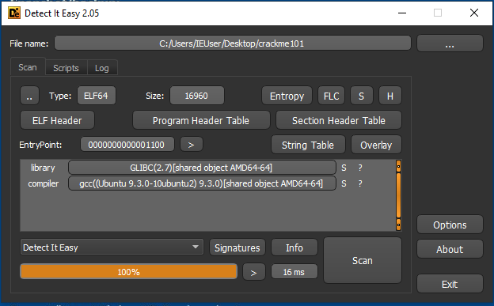

# [Write-Up] SSTF CrackMe101

## Intro



64bit elf 파일임을 알 수 있습니다. Ubuntu 20.04 64bit에서 실행을 해보겠습니다.


Password를 입력하고 정상적인 패스워드를 입력했을 시 플래그가 나오는 형식으로 생각할 수 있습니다.

Ghidra를 사용하여 crackme101이 어떤 식으로 구동되는지 확인해보도록 하겠습니다.


## crackme101 분석

```cpp
undefined8 main(void)

{
  int iVar1;
  size_t sVar2;
  long in_FS_OFFSET;
  int local_88;
  char local_78 [104];
  long local_10;
  
  local_10 = *(long *)(in_FS_OFFSET + 0x28);
  printf("Enter the password! : ");
  __isoc99_scanf(&DAT_0010206e,local_78);
  sVar2 = strlen(local_78);
  iVar1 = (int)sVar2;
  getMaskedStr(local_78,local_78,local_78);
  local_88 = 0;
  while ((local_88 < iVar1 &&
         ("Dtd>=mhpNCqz?N!j(Z?B644[.$~96b6zjS*2t&"[local_88] == local_78[(iVar1 - local_88) + -1])))
  {
    local_88 = local_88 + 1;
  }
  if (local_88 != iVar1) {
    puts("Login Failed!");
    if (local_10 != *(long *)(in_FS_OFFSET + 0x28)) {
                    /* WARNING: Subroutine does not return */
      __stack_chk_fail();
    }
    return 0;
  }
  puts("Successfully logged in!\nGood job!");
                    /* WARNING: Subroutine does not return */
  exit(0);
}
```

입력된 패스워드는 `local_78`에 들어가게 되고 `iVar1`는 입력한 패스워드의 길이가 됩니다.

`getMaskedStr` 함수에서 인자를 모두 `local_78`로 받아서 어떠한 작업을 수행한 후 "Dtd>=mhpNCqz?N!j(Z?B644[.$~96b6zjS*2t&" 문자열과 `ocal_78` 문자열을 뒷부분의 배열부터 `iVar1`의 크기만큼 비교합니다.

`local_88`과 `iVar1`이 같아야하려면 while 문의 조건인 각 문자열이 동일해야하므로 `getMaskedStr` 함수를 통과한 `local_78`의 값이 어떠한 값인지 먼저 알아야합니다.

```cpp
void getMaskedStr(char *param_1,long param_2)

{
  size_t sVar1;
  int local_18;
  
  sVar1 = strlen(param_1);
  local_18 = 0;
  while (local_18 < (int)sVar1) {
    *(byte *)(param_2 + local_18) =
         param_1[local_18] ^ "u7fl(3JC=UkJGEhPk{q`/X5UzTI.t&A]2[rPM9"[local_18];
    local_18 = local_18 + 1;
  }
  *(undefined *)(param_2 + (int)sVar1) = 0;
  return;
}
```

인자로 받은 param은 입력 받은 패스워드 값이 될 것입니다.

문자열의 길이만큼 "u7fl(3JC=UkJGEhPk{q`/X5UzTI.t&A]2[rPM9"문자열과 동일한 index끼리 xor 연산을 수행하는 것을 볼 수 있습니다.

따라서 패스워드 check가 어떠한 식으로 진행이 되는지 요약해보면

1. 패스워드를 입력을 받는다.
2. `getMaskedStr` 함수를 통해 "u7fl(3JC=UkJGEhPk{q`/X5UzTI.t&A]2[rPM9" 문자열과 동일한 인덱스끼리 xor 연산을 수행
3. 수행한 결과를 뒤집어서 "Dtd>=mhpNCqz?N!j(Z?B644[.$~96b6zjS*2t&"과 맞는지 검사
4. 맞으면 Correct

그러면 저희가 복호화할 시나리오는

1. 최종적으로 나올 값은 "Dtd>=mhpNCqz?N!j(Z?B644[.$~96b6zjS*2t&"이므로 해당 문자열과 "u7fl(3JC=UkJGEhPk{q`/X5UzTI.t&A]2[rPM9"를 뒤집은 문자열을 xor 연산
2. 나온 문자열을 다시 뒤집음
3. Get Flag!!

## Decode Code

```python
key1 = "u7fl(3JC=UkJGEhPk{q`/X5UzTI.t&A]2[rPM9"
cmp_key = "Dtd>=mhpNCqz?N!j(Z?B644[.$~96b6zjS*2t&"
result1 = ""

revkey = key1[::-1]
for i in range(len(key1)):
    result1 += chr(ord(cmp_key[i]) ^ ord(revkey[i]))

print(result1[::-1])
```


Flag : SCTF{Y0u_cR4ck3d_M3_up_t4k3_7h15_fL49}