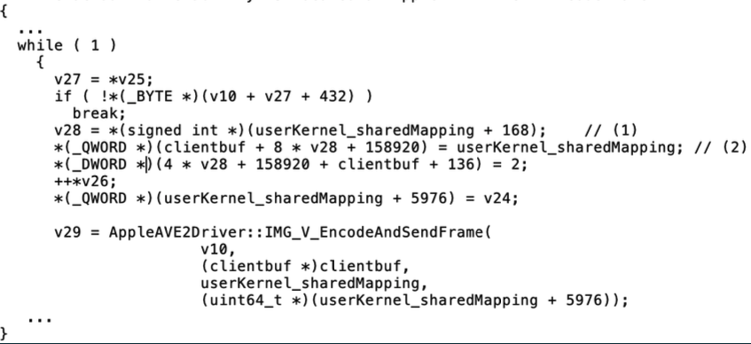

---

title: "[하루한줄] Kernel Exploitation on Apple's M1 Chip"

author: j0ker

tags: [j0ker, m1, apple, mac, kernel, driver, iokit, appleave2, encoder] 

categories: [1day1line] 

date: 2021-10-14 14:00:00 

cc: true

index_img: /img/1day1line.png

---

## URL

[Kernel Exploitation on Apple's M1 Chip]( https://github.com/ZecOps/public/blob/master/CVE-2021-30714/obts4_keynote.pdf)

## Target

M1 based Mac

## Explain

애플 M1 칩 기반의 디바이스에서 커널 드라이버 취약점이 발견되었습니다. 취약점이 발생한 `AppleAVE2` 드라이버는 IOKit 드라이버로 HJ264, HEVC 등 비디오 인코딩을 담당하는 드라이버입니다.

오늘은 첫 번째을 가져와봤습니다. 취약점 `Arbitrary Read` 취약점으로  `AppleAVE2Driver::EncodeFrame`에 존재합니다.

v28은 `user-kernel shared mapping memory`에서 바로 가져오면 따로 사이즈나 오버플로우 체크를 하지 않습니다. 드라이버에서는 `v28`을 오프셋으로 사용하여 `clientbuf`에 있는 메모리를 오버라이트하는데, 이를 통해 원하는 곳에 원하는 데이터를 쓸 수 있습니다.

메모리 커럽션은 `AppleAVE2Driver::ProcessReadyCmd`에서 발생합니다. 이 함수에서는 `clientbuf`의 범위 안에 있는 메모리에 포인터를 넣을 수 있는데, 유저스페이스에 메핑되어 있는 커널메모리를 가리키는 포인터를 넣음으로써 해당 포인터를 통해 메모리를 조작할 수 있습니다. 이를 통해 `clientbuf→cmd_nodeList` 포인터를 오버라이트하면 `AppleAVE2Driver::ProcessReadyCmd`의 세번째 파라미터(`v16`)를 조작할 수 있습니다.

`v16`을 조작하여 원하는 주소의 4바이트를 읽어올 수 있고 `AppleAVE2Driver::PreInitCreateContext` 함수를 통해 해당 값을 유저랜드로 읽어올 수 있습니다.

