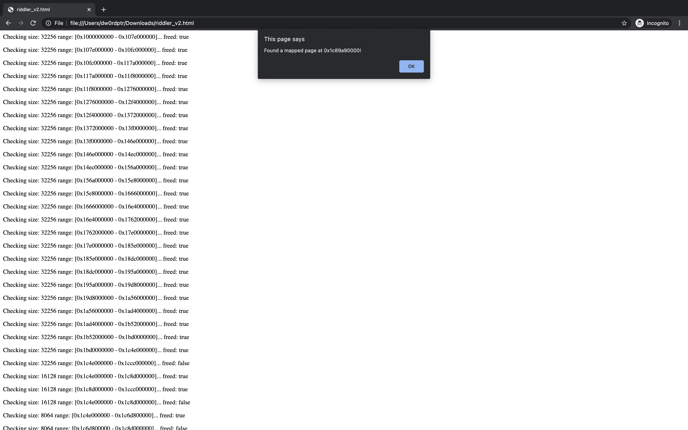

## URL

[Bypassing ASLR using Oilpan’s conservative garbage collector](https://bugs.chromium.org/p/chromium/issues/detail?id=1144662)

## Target

Google Chrome

## Explain

Google의 오픈소스 브라우저인 Chrome에서 ASLR을 우회해 매핑된 메모리 정보를 유출할 수 있는 취약점의 정보와 PoC가 공개되었습니다.

Chrome의 V8 엔진은 Oilpan garbage collector를 사용합니다. Oilpan garbage collector는 수집할 포인터를 찾기 위해 스택을 스캔하는데, 정수와 포인터의 형식을 구분하지 않아 정수가 할당된 객체 또한 포인터로 가정해 처리합니다. 이를 이용하면 다음과 같이 임의의 주소에 어떤 객체가 존재하는지 확인할 수 있습니다.

1. 객체를 할당합니다.
2. 임의의 주소 값 정수를 스택에 넣습니다.
   - 이때 충분한 수의 매개변수를 사용하면 매개 변수용으로 예약된 레지스터를 모두 사용한 뒤 garbage collector가 스캔하는 스택에 나머지 매개 변수가 저장되어 임의의 데이터를 쓸 수 있습니다.
3. 객체에 대한 모든 참조를 제거하고 garbage collection을 트리거합니다.
3. 객체가 활성화된 상태면 임의의 주소가 대상 객체를 가리킴을 의미합니다.
   - [FinalizationRegistry](https://developer.mozilla.org/en-US/docs/Web/JavaScript/Reference/Global_Objects/FinalizationRegistry) 를 사용해 객체가 garbage collector에 의해 수집될 때 호출되는 객체에 대한 콜백을 지정하면 객체가 garbage collection이 트리거 된 이후 활성화된 상태인지를 확인할 수 있습니다.

공개된 macOS 버전의 PoC를 실행한 결과는 다음과 같으며 Windows, Linux 등 다른 플랫폼의 Chrome에서도 동일한 취약점이 존재합니다.

그러나 Google 측은 해당 취약점 보고서에 대해 `WontFix`를 할당했으며 취약점임을 인지하였으나 어떠한 패치나 보상 계획이 없을 것이라고 밝혔습니다.

