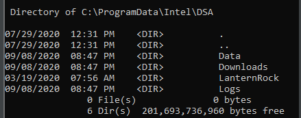
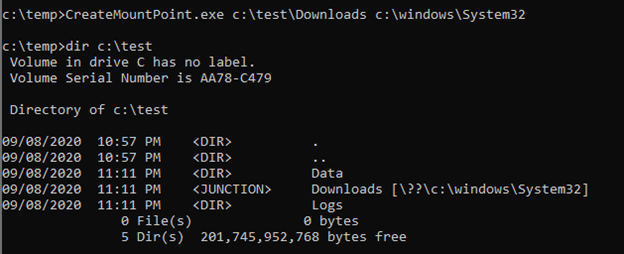

## URL

 [CVE-2021-0090: INTEL DRIVER & SUPPORT ASSISTANT (DSA) ELEVATION OF PRIVILEGE (EOP)](https://bohops.com/2021/08/07/cve-2021-0090-intel-driver-support-assistant-dsa-elevation-of-privilege-eop/)

## Target

- Intel DSA(Driver & Support Assistant)

## Explain

인텔 하드웨어에 대한 드라이버 제공을 지원하는 Intel Driver & Support Assistant (DSA)에서 발견된 권한 상승 취약점의 세부 정보가 공개되었습니다.

권한없는 사용자가 취약점을 트리거해 권한상승을 하는 세부 단계는 다음과 같습니다.

1. DSA 트레이 아이콘을 실행하고 설정 페이지에서 디렉터리 경로를 변경할 수 있습니다.

   - 기본값은 `C:\ProgramData\Intel\DSA` 이며 경로를 변경하면 DSA 서비스인 `DSAService.exe`가 기존 디렉터리의 파일들을 새로 설정한 경로로 이동시킵니다.

   - 디렉터리의 하위 구조는 다음과 같습니다.

     

2. 경로를 `c:\test` 로 변경한 뒤 하위 `Downloads` 디렉터리에 `c:\windows\System32` 를 대상으로 Directory Junction을 생성합니다.

1. `Download` 디렉터리에 payload를 포함해 컴파일한 `ualpi.dll` 파일을 배치합니다.
- `ualapi.dll`은 Windows Spooler 서비스에 의해 시스템 시작 시간(재부팅 후)에 로드됩니다.
   
2. 다시 DSA의 설정페이지에서 디렉터리 경로를 `C:\temp` 로 변경합니다.

3. DSA 서비스가 `c:\test`에서 `c:\temp`로 하위 파일들을 옮기는 과정에서 Junction으로 인해  `Download`의 `ualpi.dll`을 `c:\windows\System32` 로 이동해 기존의 정상적인 `ualpi.dll`을 대체합니다.

4. 재부팅하면 페이로드를 포함한 파일로 대체된 `ualpi.dll`이 로드되어 권한 상승이 트리거됩니다.

해당 취약점은 2020년 10월 제보되어 2021년 6월에 인텔이 패치를 릴리즈했습니다.