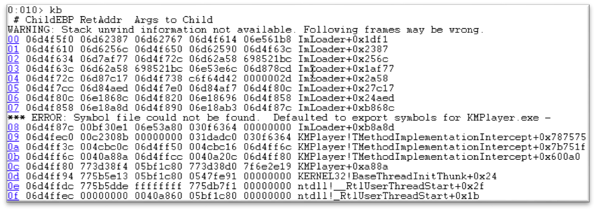
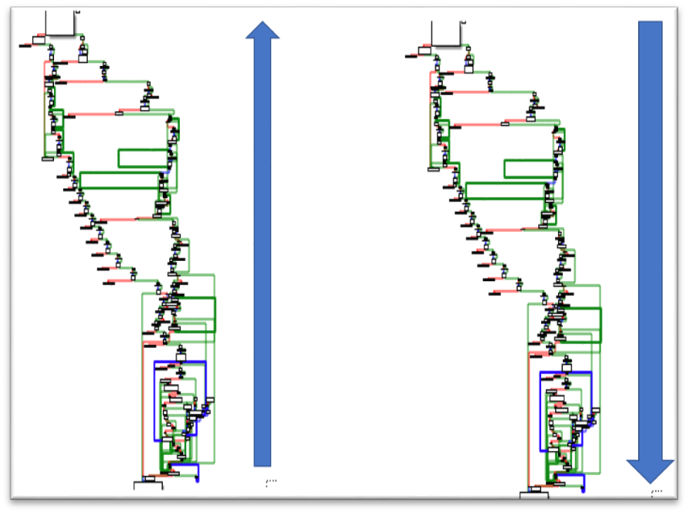
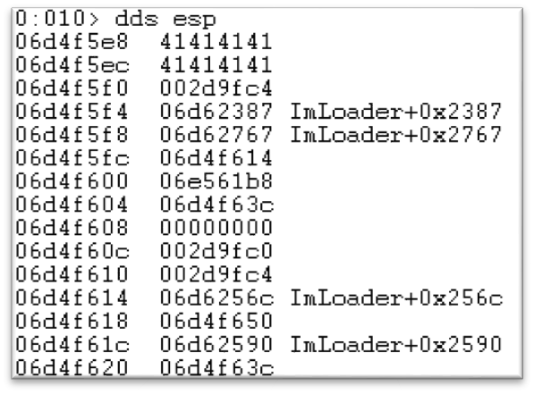
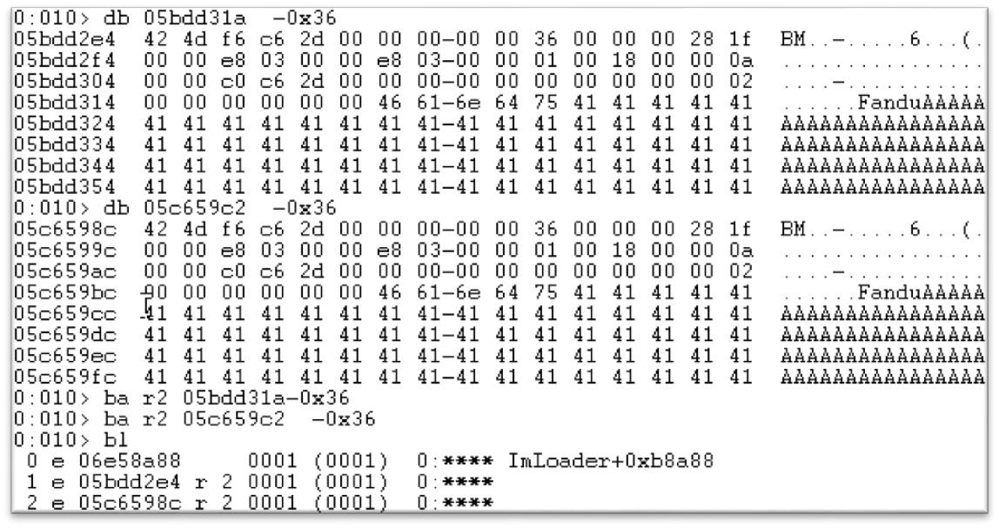

[버그헌팅 튜토리얼 Part 1 보러가기](https://hackyboiz.github.io/2021/03/07/l0ch/bughunting-tutorial/) 

[버그헌팅 튜토리얼 Part 2 보러가기](https://hackyboiz.github.io/2021/03/17/l0ch/bughunting-tutorials-part2/)

저번 글에서 예고했던 대로, 본격적인 분석을 시작해보겠습니다! 이번 글은 삽질에서 시작해 삽질로 끝나는 글이므로 멘탈 나감에 유의하시기 바랍니다... 뭐 어쨌든 익스 하기만 하면 되니까요! 그럼 Part 3 시작하겠습니다.


# From Crash to Exploit

이제 제 퍼저에서 나왔던 크래시를 분석해볼게요.(위에 있는 시드 파일로 돌린 건 아닙니다. 저도 귀찮아서 그냥 크롤링해서 썼어요 ㅎㅎ) 

일단 크래시 폴더에 들어가면 이렇게 파일들이 존재합니다.


다른 거를 먼저 보기 전에 먼저 크래시가 재현되는지 확인해야 합니다. 간혹 가다가 재현이 안 되는 경우가 있습니다. 힙 문제여서 재현이 안 되는 경우가 대부분입니다. 재현이 잘 안 되는 크래시일 경우에는 디버깅하기에도 힘들기 때문에 재현되는 확률을 보고 확률이 너무 낮으면 다른 크래시를 분석하시는 것을 추천드립니다. 

그리고 재현이 되는 지를 확인할 때에는 JIT 모드로 확인해야 합니다. 디버거를 붙인 상태에서 프로그램이 실행되면 디버거를 안 붙인 상태랑 힙 배정 등이 조금씩 달라서 재현이 되던 게 안되기도 하고 이상한 데서 크래시가 나기도 합니다. Windbg의 경우 관리자 권한으로 킨 CMD 창에서 `windbg –I` 명령어만 입력하면 바로 JIT 기능을 사용할 수 있습니다.

재현이 되는지 확인한 다음에는 보통 msec 확장자 전에 `e0`으로 되어 있는 파일을 봅니다. msec 파일은 크래시 발생 때의 모든 로그를 보여주는 데요. `e0`이 아마 처음 크래시를 났을 때의 로그 같습니다. 근데 다른 거 봐도 되긴 하는 데 저는 보통 이거 하나만 봐요. 앞에 것들은 좀 뛰어넘고 뒤에 레지스터 정보들부터 볼게요.


운 좋게 바로 `call`에서 터졌네요!!! 뭐 이거는 운이 좋은 경우니까 ㅠㅠ 보통 다른 크래시들은 `call`이나 `jmp`에서 나는 경우가 거의 없죠 ㅠㅠㅠ 그래도 분석 방법은 똑같으니까 걍 분석하면 됩니다.

이 크래시의 시드 파일 같은 경우에는 제가 인터넷에서 크롤링해서 넣은 시드 파일이라 데이터가 뭐가 들어가 있는지 모릅니다. 사실 시드 파일을 위에서 처럼 직접 만들어서 하는 것도 좋지만 귀차니즘이 발동하고 직접 만들기 힘든 파일들도 있기 때문에 인터넷에서 크롤링해오는 것도 좋은 방법입니다. (사실 가장 큰 이유는 귀찮기 때문이죠)

암튼 이럴 때에는 먼저 hxd로 컨트롤된 값을 찾아보는 게 좋습니다. 운이 좋으면 진짜 컨트롤할 수 있는 값이 바로 있는 경우가 있거든요. 저도 이 파일을 분석할 때 운이 좋게도 `ecx`의 값이 바로 파일에 저장되어 있었고 바로 `ecx`를 컨트롤할 수 있었습니다.(뒤에 나오겠지만 메모리에 ASLR 이 걸려있어서 큰 의미는 없습니다) 보통 값에서 더하거나 빼거나 또 포인터로 사용해서 다른 값을 가져오거나 하는 경우가 많기 때문에 많은 기대를 하면 안 됩니다.... 후우... 

이 정도로는 대충 알았고 다음으로 콜 스택을 봅시다.


크래시가 발생하기 직전 어떤 함수들이 불려졌는지 대략적으로 확인할 수 있습니다. 사실 이래 놓고 실제로 디버거에 확인해보면 콜 스택이 깨져있거나 좀 다르거나 하는 경우도 있는 데 여기에서는 그냥 참고만 하면 됩니다.

다음으로는 !exlploitable 모듈에서 나온 결과물입니다.


BFF에서는 !exploitable 의 결과로 해당 크래시가 exploitable 한 지 안 한 지를 판단하는데 사실 exploitable로 나온 거는 그럴싸하긴 한데 다른 거는 잘 모르겠네요. 개인적으로는 Unknown에 있는 크래시들이 더 익스 잘된다는 말이 많아서 이 부분은 왜 크래시가 났는지, exploitable 한 이유가 뭔지만 참고하고 넘어가면 될 거 같습니다.

간단하게 어떤 유형의 크래시인지 파악을 했고 이게 익스 가능성이 있다고 판단되면 어떤 바이트가 뮤테이트 되었는 지를 확인합니다. 앞에서 파일의 구조를 알았으니 어떤 바이트가 뮤테이트 되었는 지를 확인한다면 그 바이트가 어떤 역할을 하는지 대충은 알 수 있고 왜 크래시가 발생했는지 추측이 가능하겠죠.

Hxd로 오리지널 파일과 minimized 된 파일을 열어서 ctrl+k 를 누르면 두 파일의 차이점을 알 수 있습니다.


```c
BITMAPINFOHEADER.biSize : 0x00 -> 0x1f
BITMAPINFOHEADER.biCompression : 0x00 -> 0x0A
BITMAPINFOHEADER.biClrUsed : 0x00 -> 0x02
```

이렇게 바뀌었네요. `BiSize` 는 `BITMAPINFOHEADER` 의 크기를 나타내는 데 위에 본 구조로는 아무리 봐도 크기가 달라질 수 없다는 걸 알 수 있습니다. 따라서 프로그램에서 “여기에 있는 데이터를 가져와서 복사를 하는 데 이 데이터가 기존 크기보다 크게 되면서 복사를 더 많이 하게 된고 오버플로우가 발생하게 된다”라고 추측할 수 있을 거 같습니다.

`biCompression` 과 `biClrUsed` 는 각각 압축 방식 그리고 사용된 색상수를 의미하는데 이 부분은 리버싱을 해봐야지 어떤 역할을 하는지 알 수 있겠네요.

본격적으로 리버싱을 진행할 건데 사실 리버싱을 하기 전 혹은 하면서 시나리오를 생각하고 리버싱을 진행하는 것이 좋습니다. 어느 정도는 추측을 하고 시나리오대로 리버싱을 하면 확실이 그냥 막무가내로 하는 것보다는 시간이 덜 소모되고 화가 덜 납니다 ㅎㅎ 여기에서는 일부로 시나리오를 작성 안 하고 진행할 것이지만 이 글을 다 읽고 실제로 진행할 때에는 대략적인 시나리오를 생각해두고 진행하면 좋겠죠.

그럼 이제 디버거에 붙여서 리버싱을 해볼게요. 여기에서 디버깅은 모두 windbg를 사용하겠습니다.

처음 버그헌팅을 할 때에는 이전부터 써오기도 했고 GUI 가 한눈에 딱 들어와서 이뮤니티를 쓰긴 했는 데 속도 문제 때문에 windbg로 넘어왔습니다. 특히 익스 할 때 스프레이를 해야 하는 데 정말 속 터져서;;; 제 가상 머신의 사양이 낮아서도 있겠지만 아예 뻗어버리더라구요. 그래서 windbg를 사용했더니 시간이 많이 단축되었습니다. 쓰다 보니까 원하는 거를 명령어만 간단하게 치면 원하는 것만 딱 볼 수 있어서 편하기도 해고... 지금까지 쓰고 있네요 ㅋㅋ 처음에는 CUI라는 게 좀 많이 어색하긴 하지만 크래시 분석하면서 계속 쓰다 보면 익숙해집니당.  

[http://windbg.info/doc/1-common-cmds.html](http://windbg.info/doc/1-common-cmds.html) 

windbg 쓸 때 위 링크를 옆에 띄워놓고 원하는 거 하나하나 찾아가면서 써보시면 도움이 많이 될 거 같네요. 처음에는 보면서 하다가 나중에는 안 보고도 잘 쓰는 나 자신을 발견할 수 있습니다 ㅋㅋㅋ

그럼 아까 직접 제작한 파일에 똑같이 값들을 위 값들로 바꾸고 비트맵 부분을 모두 `0x41`로 바꾼 다음 디버거로 보겠습니다.


`eax`가 우리가 넣은 `0x41414141`로 바뀌었네요. 그럼 이 값이 어디서 오는지 봅시다.


현재 `eip` 바로 위 인스트럭션을 보면 `esp`가 가리키는 주소에서 `eax`값을 가져오네요. 잉 근데 여기 스택인데???(이거 스택 오버 취약점 아니었는데;;;)
그럼 우리가 만든 파일이 어디에 로드되었는지 볼게요.


뭔가 매우 많이 있네요;;; 비트맵 정보가 전체적으로 올라와 있는 건 `0x0725f056` ~ `0x0753b70d` 정도인 거 같네요. 그리고 스택에 있는 데이터는 이 중 어딘가에서 값을 가져온 걸로 보이고요. 아직은 뭔 갈 알 수는 없네요. 이제 콜 스택을 보면서 오버플로우가 어디에서 발생했는지 확인해 봅시다.



여기서 주의해야 할 것은 저 `WARNING`이라고 뜬 부분인데요. 디버거에서 콜 스택을 프로그램 카운터를 기반으로 보여주는데 이게 잘못되어서 제대로 못 보여주는 겁니다. 따라서 저대로 따라가도 프로그램의 흐름을 알 수가 없습니다. 그럼 어떻게 분석을 해야 할까요 ㅠㅠㅠ

보통 바이너리를 분석하는 방법은 두 가지가 있는 데 “탑다운” 방식과 “바텀업“ 방식이 있습니다.(당연히 위에서 아래로 아래에서 위로 가지 좌우로 갈 순 없잖아요?)



뭐 암튼 크래시가 난 그 함수에서 위로 올라가면서 볼 것이냐 아니면 크래시가 나는 부분 좀 위에서부터 모든 코드를 볼 것이냐가 문제인데… 이거는 각자의 성향 혹은 상황에 따라 결정하시면 됩니다. 최대한 분석 범위를 줄여서 리버싱 시간을 단축시키는 게 제일 현명한 선택이지만 저 같은 경우는 다른 취약점도 찾을 겸 탑다운 방식을 선호하는 편입니다.(시간 졸라 오래 걸리지만….) 주의해야 할 것은 탑다운 방식을 진행할 때 어디서부터 할지 잘 정해야 한다는 것입니다. dib 포맷의 경우에는 워낙 구조가 단순해서 분석해야 할 코드 커버리지가 작지만 다른 포맷의 경우 분석해야 할 코드량이 방대할 수 있습니다. 그렇기 때문에 분석할 뮤테이트 된 바이트를 사용하는 부분을 찾고 어떤 작업을 하는지 파악한 다음, 그 부분을 처리하는 코드의 시작 부분을 찾아내는 것이 중요합니다 ㅋㅋㅋ

그럼 이제 처음 해석하는 부분을 찾아야 하는데 헤더 부분이 BM이었죠? 분명 코드에 헤더를 비교하는 부분이 있겠죠. 그래서 아이다에서 `BM`이라는 문자열이 있는지 확인합니다.


는… 망.. 없네…. 다른 건 다 있던데… 역시 인생은 내 맘대로 안되는군… 그럼 이제 편한 방법이 없으니 직접 찾아보도록 합시다 ㅠㅠ

콜 스택이 제대로 나오지 않으면 하나하나 볼 수밖에 없습니다.



이중에 아무거나 한 번 볼게요. 


리턴 어드레스라면 바로 위 인스트럭션이 `call`이어야 하는데 `ret`이네요. 이 주소는 우연히 그냥 그 모듈을 가리키고 있을 뿐입니다. 저렇게 `dds` 명령어를 입력해서 보이는 주소들이 모두 리턴 어드레스인 것만은 아닙니다. 따라서 하나하나 확인을 하고 디버깅을 진행해야 합니다. 스택 좀 위에서 유효한 리턴 어드레스를 찾아봅시다.


이 리턴 어드레스는 괜찮은 거 같네요! 그럼 여기에 브레이크 포인트를 걸고 디버깅을 해봅시다.


처음에는 이렇게 뜨면서 로딩이 좀 느리게 되는데 `sxe ld ImLoader.dll` 명령어를 치면 `ImLoader.dll` 이 로드될 때 브레이크 포인트를 걸 수 있습니다. 그렇게 되면 저렇게 느리게 로딩되지는 않겠죠. 모듈이 로드되고 브포를 걸게 되면 좀 더 빠르게 진행할 수 있습니다.


정상적으로 원하는 지점에서 잘 걸리네요. 그럼 파일이 업로드되었는지 봅시다.




이 중 두 부분만 헤더 정보를 가지고 있네요. 그럼 헤더까지 있는 메모리에서 헤더 부분에 메모리 브레이크 포인트를 걸고 앞으로 실행하는 과정에서 어느 부분의 코드에서 해당 메모리에 접근하는지를 볼게요.


…는 Fail…. 괜찮아요… 이럴 수 있죠…. 꼼수 쓰지 말고 코드 분석하라는 신의 계시입니다. 아마 파일 스트림에서 다시 가져와 비교를 하거나 다시 다른 곳에 할당하거나… 아니면 여기도 제일 위가 아니거나… 여러 시나리오가 있을 수 있겠네요. 뭐 다른 데 브포 걸어서 할 수도 있지만 다른 방법도 써볼게요. 그 다른 방법은 Part 4에서 설명하겠습니다. 

# Part 4 예고


> EIP가 안잡히잖아!!!!