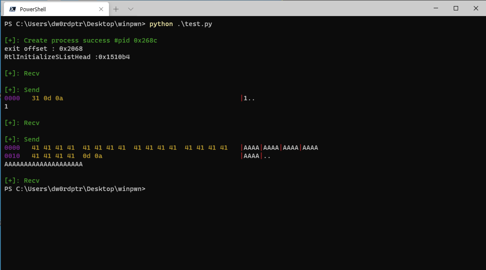

# 시리즈 바로가기
Pwn하고 Cool하고 Sexy한 Windows 탐방기 Part 1 - pwntools for windows

[Pwn하고 Cool하고 Sexy한 Windows 탐방기 Part 2 - NT Heap](https://hackyboiz.github.io/2021/02/28/l0ch/pwncoolsexy-part2/)

[Pwn하고 Cool하고 Sexy한 Windows 탐방기 Part 3 - NT Heap(2)](https://hackyboiz.github.io/2021/03/28/l0ch/pwncoolsexy-part3/)

[Pwn하고 Cool하고 Sexy한 Windows 탐방기 Part 4 - HITCON 2019 dadadb](https://hackyboiz.github.io/2021/04/18/l0ch/pwncoolsexy-part4/)

[Pwn하고 Cool하고 Sexy한 Windows 탐방기 Part 5 - HitCON 2019 dadadb(2)](https://hackyboiz.github.io/2021/05/09/l0ch/pwncoolsexy-part5/)


---

안녕하세요 L0ch입니다! 오늘은 새로 연재할 시리즈물을 주섬주섬 챙겨 왔습니다. 제목부터 정상이 아닌 느낌이 슬슬 오시죠..?

때는 시리즈물 기획 회의 중 아무 생각 없이 "펀(pwn)쿨섹좌 컨셉 어떰?"이라고 말했는데 팀원들 반응이 격하더라구요.


> 내가 이 구역의 미친X이다!!

회의하면서 딴짓하다가 뱉은 말이 본의 아니게 극찬(?)을 들어버려 탄생한 새로운 시리즈.. 과연 제대로 마무리할 수 있을지!


# pwnable은 cool하고 sexy하게


> 포너블을 할 때는 즐거워야 합니다. 그리고 쿨하고 섹시해야 하죠

*~~오늘부터~~* 제 좌우명입니다. 밑도 끝도 없이 cool하고 sexy하게 포너블을 뿌수는 것을 목표로 하는 시리즈입니다.

그래도 계획은 세우고 뿌셔야겠습니다.

- 툴 소개
- Windows exploit technique
- CTF Challenge

정도로 진행될 예정이며 part 5까지 구상중이지만 뭐 사람 일은 어떻게 될지 모르는거니 일단 시작해보죠 ㅎ 시리즈 첫 글은 가볍게 출발하기 위해 간단한 Windows 툴 소개 정도로 하려고 합니다.


# pwntools for windows - winpwn

포너블을 공부하셨던 분들이라면 pwntools은 모르시는 분이 없을 거라고 생각합니다. 리눅스 포너블을 할 때 꼭 필요한 툴이죠.
그런데..! pwntools은 윈도우 환경의 익스플로잇은 지원하지 않습니다. ㅠㅠ 

[winpwn](https://github.com/Byzero512/winpwn)은 기존 pwntools에서 공식적으로 지원하지 않는 윈도우 환경의 바이너리 분석, 익스플로잇을 위한 툴입니다. pwintools이란 이름의 비슷한 기능을 지원하는 모듈도 있던데, 제 기준에서는 winpwn이 쓰기에 더 편하더라구요. 그래서 오늘은 winpwn에 대해 짧게 소개해보겠습니다.


# 설치

`pip/pip3 install winpwn` 으로 설치할 수 있습니다. 다만 디버거 기능을 사용하기 위해서는 아래 과정이 추가로 필요합니다.

1. `C:\\Users\\[사용자]` 경로에 [.winpwn](https://github.com/Byzero512/winpwn/blob/master/.winpwn) 파일을 생성해 설치되어 있는 디버거 경로를 설정합니다. 이후에 디버거를 사용할 때 코드에서 직접 설정할 수도 있습니다.
2. 다음 파이썬 패키지를 설치합니다
   - pip install pefile
   - pip install keystone
   - pip install capstone

keystone 설치 시 발생하는 에러는 Visual C++ Compiler for Python 2.7 또는 OpenSSL 설치로 해결할 수 있습니다. 이런 불친절한 설치 에러 메시지..


> 그래도 파이썬인게 어디에요 ㅋㅋ

추가로 Windows Terminal을 사용해야 예쁘게 출력되는 걸 볼 수 있으니 Microsoft Store에서 설치해주세요. Windows Terminal을 설치하셨다면 이제부터 cmd랑 파워쉘 갖다 버리고 이거 쓰시면 됩니다. 


> Windows Terminal 쓰세요!! 두 번 쓰세요!!!


# 기능

설치도 했으니 어떤 기능들이 있는지 쓰윽 둘러봐야겠죠? 

우선 기존 pwntools에서 제공하는 기본적인 기능들은 대부분 지원하며 거기에 Windows에서 사용하는 PE 바이너리 분석을 위해 지원하는 몇 가지 기능이 추가되었죠. 지금부터 하나씩 살펴보도록 하겠습니다!


## Debugger attach

기존 pwntools에서는 `gdb.attach()` 를 사용해 gdb에 attach 할 수 있었다면 pwintools에서는 `windbg.attach()` 을 사용해 바이너리를 windbg에 attach 할 수 있습니다. windbg preview, x64dbg, mingw gdb도 사용이 가능하며 브레이크 포인트 등의 script도 사용할 수 있습니다.

간단한 예제로 windbg preview에 attach 해보겠습니다.

```python
from winpwn import *

#.winpwn 설정하지 않았을경우 작성
#context.debugger="windbgx"
#context.windbgx="C:\\Users\\dw0rdptr\\AppData\\Local\\Microsoft\\WindowsApps\\Microsoft.WinDbg_8wekyb3d8bbwe\\WinDbgX.exe"

p = process("./binary.exe")
windbgx.attach(p, script="bp 0xbe1106")

print(p.recvuntil(">"))
p.sendline("1")
print(p.recvuntil(">"))

p.sendline("A"*40)

input()
```


위 사진과 같이 windbg preview도 잘 붙고, 브레이크 포인트도 아주 잘 걸린 것을 확인할 수 있습니다. 넘나 편한것...


## Symbol

pwntools에서 `elf`로 바이너리를 열어 함수 주소을 구하듯이 winpwn에서는 `winfile` 로 pe 파일을 열어 `symbols` 함수로 바이너리와 dll의 함수 주소의 IAT/EAT offset을 가져올 수 있습니다.

```python
from winpwn import *

context.log_level = "debug"
context.arch="i386"

p = process("./binary.exe")

pe = winfile("./binary.exe")
ntdll = winfile("./ntdll.dll")

print("exit offset : "+hex(pe.symbols["exit"]))
print("RtlInitializeSListHead :"+hex(ntdll.symbols["RtlInitializeSListHead"]))

p.recvuntil(">")
p.sendline("1")
p.recvuntil(">")
p.sendline("A"*20)
p.recvuntil(">")
```



바이너리와 `ntdll.dll`을 로드해 각 모듈의 함수 오프셋을 확인할 수 있습니다.

그 외에도 `context.log_level`을 `debug`로 설정해 pwntools에서 익숙하게 봤던 send, receive 정보가 출력되는 것도 볼 수 있네요!


## Disable DYNAMICBASE

winpwn에서는 필요한 경우 바이너리가 로드되는 시작 주소를 랜덤하게 배치하는 DynamicBase 기능을 간편하게 끄고 킬 수 있습니다. 일일이 바이너리의 `IMAGE_DLLCHARACTERISTICS_DYNAMIC_BASE` 섹션을 수정할 필요가 없죠

```python
def NOPIE(fpath=""):
    import pefile
    pe_fp=pefile.PE(fpath)
    pe_fp.OPTIONAL_HEADER.DllCharacteristics &= \
        ~pefile.DLL_CHARACTERISTICS["IMAGE_DLLCHARACTERISTICS_DYNAMIC_BASE"]
    pe_fp.OPTIONAL_HEADER.CheckSum = pe_fp.generate_checksum()
    pe_fp.write(fpath)
def PIE(fpath=""):
    import pefile
    pe_fp=pefile.PE(fpath)
    pe_fp.OPTIONAL_HEADER.DllCharacteristics |= \
        pefile.DLL_CHARACTERISTICS["IMAGE_DLLCHARACTERISTICS_DYNAMIC_BASE"]
    pe_fp.OPTIONAL_HEADER.CheckSum = pe_fp.generate_checksum()
    pe_fp.write(fpath)
```

`NOPIE("./binary.exe")` 혹은 `PIE("./binary.exe")` 로 사용하면 됩니다.

위에서 설명한 기능 외에도 프로세스 메모리를 읽고 쓸 수  있는 `readm`, `writem` 등 유용한 기능이 많습니다. 그 외의 기능들은 pwntools를 만져보셨던 분들이라면 똑같으니 금방 익숙해질 겁니다..!


# 마치며

윈도우 포너블을 시작할 때 진입장벽이 새로운 환경과 툴인데, 익숙한 툴을 사용해 접근하면 괜찮지 않을까 하고 소개한 툴이었습니다!
다음 글에서는 Windows의 Low Fragmentation Heap을 주제로 돌아오겠습니다.  

cool하고 sexy하게 포너블을 부수는 그날까지..!