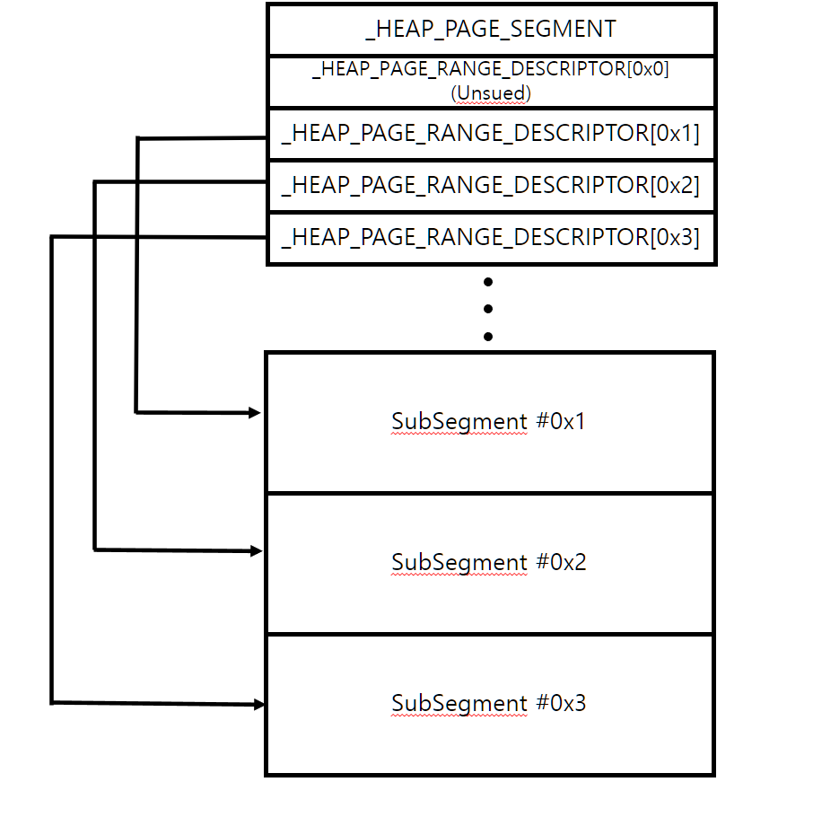

# HITCON CTF 2020 - Archangel Michael's Storage

저번 파트에서 문제의 OOB Write 취약점까지 확인했으니 익스플로잇 시나리오를 짜보도록 할게요! 먼저 주소를 leak 해보도록 하겠습니다.

## Overlap Chunk

바이너리를 분석해보면 HeapAlloc을 사용해 Private Heap에 할당을 하는 것을 확인할 수 있습니다.

OOB Write를 이용해 [_HEAP_PAGE_RANGE_DESCRIPTOR](https://hackyboiz.github.io/2021/10/10/l0ch/segment-heap-part2/#HEAP-PAGE-RANGE-DESCRIPTOR)의 `UnitCount`를 Overwrite합니다.  `UnitCount`는 Subsegment의 페이지 수, 그러니까 Subsegment의 크기를 의미합니다. UnitCount를 수정하면 원래 Subsegment보다 큰 크기를 해제할 수 있겠죠. 그리고 해제한 Subsegment를  다시 할당한 다음 할당하는 SubSegment는 기존에 사용되던 SubSegment 주소에 할당하게 되고  두 청크가 겹친 Overlap Chunk 상태가 됩니다.

그림을 보면서 이해하겠습니다.



우선 [_HEAP_PAGE_SEGMENT](https://hackyboiz.github.io/2021/10/10/l0ch/segment-heap-part2/#HEAP-PAGE-SEGMENT)는 `_HEAP_PAGE_RAGE_DESCRIPTOR` 배열이 있는 SubSegment 헤더의 정보가 있습니다. 그리고 그 뒤에 각 `_HEAP_PAGE_RANGE_DESCRIPTOR` 배열이 있는데, 이전 파트에서 설명한 대로 배열의 첫 번째 `_HEAP_PAGE_RANGE_DESCRIPTOR` 는 쓰이지 않고, 두번째 요소부터 각각 0x2000 이후의 SubSegment 크기와 같은 정보를 나타내고 있죠.

OOB Write와 같은 취약점으로 두 번째 SubSegmnt의 `_HEAP_PAGE_RANGE_DESCRIPTOR->UniCount`를 수정하면, 아래 그림과 같이 세 번째 Segment까지 포함하도록 만들 수 있습니다.


그리고 두 번째 세그먼트를 해제하면 아래 그림처럼 됩니다.


두 번째 SubSegmnt의 범위가 세 번째 SubSegment까지 포함하고 있으니 현재 사용중인 세 번째 SubSegment까지 해제하게 되죠.

이후 네 번째, 다섯번째 SubSegment를 할당합니다.   


해제된 공간에 재할당하기 때문에 네 번째 SubSegment는 기존 두 번째 SubSegment 위치에 할당하고, 다섯번째 SubSegment는 `_HEAP_PAGE_RAGNE_DESCRIPTOR` 변조로 인해 해제된 것으로 인식한 세 번째 SubSegment 위치에 재할당합니다. 결과적으로 중복된 청크를 가리키는 Overlap Chunk가 생성됩니다. 

이 Overlap Chunk를 활용하면 arbitrary read/write로 필요한 메모리를 leak하는 것부터 익스까지 가능하곘죠!

## Overlap Chunk - Archangel Michael's Storage

우선 청크를 할당해봅시다.

```python
alloc(0,0x8000) # int 0
alloc(1,0x1337) # secret 1
alloc(0,0x8000) # int 2

alloc(3,0x20000-1) # str 3 (overlap chunk)
alloc(0, 0x3bd0) # int 4
alloc(0,0x8000) # int 5
```


`binary+0x5640` 에 위치한 전역변수 `Storage` 구조체에 할당한 6개의 청크의 주소를 확인할 수 있습니다. 문자열 포인터가 있는 네 번째 Storage를 보면?


이렇게 문자열을 저장하는 청크가 할당된 포인터도 보입니다. 

생성된 세그먼트의 정보가 저장되는 `_HEAP_PAGE_RANGE_DESCRIPTOR`의 현재 상태를 먼저 확인해봅시다. [Part 2](https://hackyboiz.github.io/2021/10/10/l0ch/segment-heap-part2/#Segment-Structure) 에서 설명했듯이 생성된 세그먼트는 `_SEGMENT_HEAP` → `SegContexts` → `SegmentListHead`에서 참조한다고 했었죠. 


`_SEGMENT_HEAP`의 `SegContexts`로 들어가서,


`SegmentListHead`를 참조하면


이 주소가 [_HEAP_PAGE_SEGMENT](https://hackyboiz.github.io/2021/10/10/l0ch/segment-heap-part2/#HEAP-PAGE-SEGMENT) 주소입니다. 이 주소를 Segment base라고 부를게요 (캡쳐하다가 여러 번 재실행해서 힙 주소가 바뀌었습니다 ㅎㅎ..! 헷갈리지 않기 위해 통일!)


`_HEAP_PAGE_SEGMENT` 심볼로 보면 `DescArray`필드가  [_HEAP_PAGE_RANGE_DESCRIPTOR](https://hackyboiz.github.io/2021/10/10/l0ch/segment-heap-part2/#HEAP-PAGE-RANGE-DESCRIPTOR) 구조체 배열인 것을 확인할 수 있습니다.


각 구조체는 0x20 byte 크기고 필드는 위와 같습니다. 하나하나 보기 어려우니 메모리에서 한번에 살펴볼게요.


첫 0x40 byte는 헤더 정보와 사용하지 않는 unused 이고, 0x40부터는 각 0x20 마다 세그먼트의 각 페이지의 정보를 담고 있습니다. 우선 할당된 SubSegment의 첫 페이지인 경우 Signature `0xCCDDCCDD` 가 설정됩니다. 그리고 첫 페이지인 경우 UnitSize 필드에 할당된 세그먼트의 크기, 그러니까 사용하는 페이지 개수 정보가 저장됩니다. 크기가 21개니까 해당 페이지를 제외하고 20개의 페이지를 더 사용한다는 말이겠네요. 그 뒤에 페이지들은 첫 페이지가 아니므로 UnitOffset으로 활용되어 첫 페이지와의 오프셋이 20까지 차례대로 저장됩니다. 

> `UnitSize`와 `UnitOffset`은 같은 필드를 말합니다. 페이지가 첫 번째 페이지면 `UnitSize`, 아니면 `UnitOffset`으로 사용됩니다.
> 

이제 OOB write 취약점으로 세 번째 청크(SubSegment)의 사이즈를 변조해보도록 할게요.

```python
# 0x1f017900000 : _HEAP_PAGE_SEGMENT -> Segment base
# segment base + 0x23050 : chunk 2(secret storage)
# segment base + 34010 : chunk 3(int storage)
secret_off = 0x23050
target_seg_desc_off = 0x698
setvalue(1,1, -((secret_off-target_seg_desc_off)/8)-1,0x4204ffbd00000103) # overwrite size  type 1
```

우선 두 번째 청크 주소를 활용해 변조할 주소를 구하는데, 두 번째 청크 주소는 `Segment base + 0x23050` 입니다. `_HEAP_PAGE_SEGMENT` 주소와의 오프셋은 0x23050이고, `_HEAP_PAGE_SEGMENT`로부터 세 번째 세그먼트의 `PAGE_RANGE_DESCRIPTOR→UnitSize` 오프셋은 0x698입니다.

> 한 페이지 크기가 0x1000이고, 한 페이지당 0x20 크기의 `_HEAP_PAGE_RANGE_DESCRIPTOR` 에서 관리합니다.
→ 0x34000 오프셋의 페이지는 0x680 오프셋의 `_HEAP_PAGE_RANGE_DESCRIPTOR` 에서 관리합니다.
> 

setvalue의 OOB write 취약점으로 `Segment base + 0x698`  주소의 세 번째 청크 `UnitSize`를 변조할 수 있습니다.


변조 전 `Segment base + 0x680` 값은 `0x2104ffde00000103`으로, `UnitSize`는 0x21입니다.


OOB write로 이렇게 `UnitSize`를 0x42로 변조할 수 있습니다!

이제 세 번째 청크를 해제하면, 변조된 사이즈로 인해 뒤에 할당된 청크도 FreeList에 들어가고 이후 재할당 시 이미 할당된 청크에 다시 할당하는 Overlap Chunk를 생성할 수 있습니다.

```python
destory(2)
alloc(0,0x8000) # int 2 (realloc)
alloc(3,0x200) # str 6
alloc(1,0xbeef) # secret 7
```

세 번째 청크를 해제하고, 같은 크기로 재할당 한 뒤에 할당하는 7번째(index 6) 청크가 Overlap Chunk가 됩니다.


엥? 그런데 여기에 중복된 청크가 없지 않냐구요?  


정답은 네 번째 string storage 청크의 문자열에 할당한 청크였습니다! 

## Memory Leak - heap

방금 만든 Overlap Chunk를 이용해서 필요한 주소를 구해보겠습니다. 먼저 heap 주소부터 leak해야겠죠.

```python
setvalue(3, 3, 0x40+1, "a"*0x40)
```

네 번째 string storage 청크에 a를 40개를 씁니다.


그럼 네 번째 청크의 문자열 청크 주소에 입력한 40개의 a가 들어갑니다. 그런데, 아래 보이는 `segment base + 0x55050`는 아까 생성한 7번째 Overlap chunk네요. a로 채운곳과 7번째 청크의 문자열 힙 포인터 사이 8바이트를 더 채우고 네 번째 청크 문자열을 출력하면 뒤의 힙 청크 주소를 출력할 수 있을 것 같습니다!

```python
setvalue(7,1,-0x4b ,0x6161616161616161)
```


set value type 1로 `0x6161616161616161` 을 `-0x4b` index에 쓰면 문자열 청크 포인터 전까지 모두 채울 수 있습니다. 

```python
getvalue(3)
p.recvuntil("a"*0x48)
vs_segment = u64(p.recvuntil("\r\n")[:-2].ljust(8,"\x00")) - 0x80
print("vs_segment:",hex(vs_segment))
```


그리고 네 번째 청크 문자열을 출력한 결과를 보면 힙 주소(VS 세그먼트) 주소를 leak한 것을 볼 수 있네요!

마지막 파트 5에서는 leak한 주소를 이용해 ntdll 등 기타 익스에 필요한 주소를 구하고 쉘까지 띄우는 것으로 마무리하겠습니다. 아마 2022년에 올라오겠네요 ㅎㅎ 내년에 마지막 파트로 찾아오겠습니다!