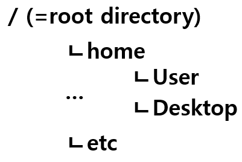
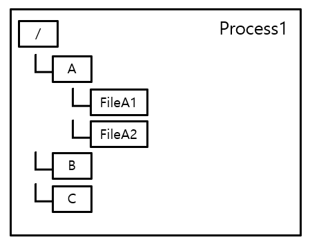
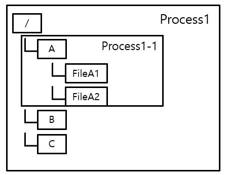

## Root directory

우리가 흔히 `cd /home/User/Desktop/...` 와 같은 명령어를 사용할 때도 맨 앞에 '`/`'가 사용되는 것처럼 root directory는 유닉스 시스템에서 '`/`'로 쓰여지고 있습니다. 이로 부터 알 수 있듯이 root directory는 시스템에서 최상위 위치에 존재합니다.즉, 상위 directory가 존재하지 않는 시스템 상 위치를 root directory라고 할 수 있습니다.

## 작동 방식

chroot가 실제로 어떻게 작동하는지 흐름에 대해 알아보겠습니다. 먼저, 시스템 상에 가상의 프로세스가 올라간 상황을 가정해보겠습니다.

해당 프로세스가 실행되면 root directory를 기준으로 접근하고자 하는 파일들에 대해 탐색을 시작하게 됩니다. 예를 들어 `FileA1`에 접근하고자 한다면 root directory를 기준으로 `/A/FileA1` 과 같이 접근하게 됩니다.

하지만 여기서 `chroot /A /bin/bash` 와 같은 명령어로 root directory를 변경해준다면 위와 같이 `Process 1`의 자식 프로세스로써 `Process1-1`이 생성되고 해당 Process의 루트 디렉토리는 `/A`가 되게 됩니다.  `Process1-1`에서는 directory `/B`와 `/C`및 해당 directory의 하위 디렉토리 파일에 대해 접근하지 못하게 됩니다. 그래서 정보 유출과 그로 인한 피해를 최소화하는 수단으로 많이 이용되었던 기술입니다.