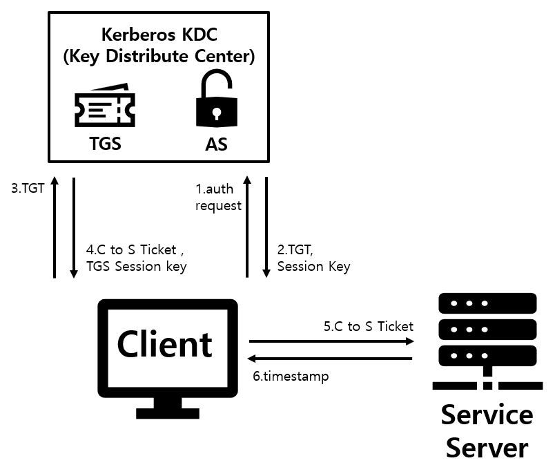

# What is Kerberos!

Kerberos 이름만 들어도 무시무시합니다! 사실 지옥견을 칭하는 케르베로스의 약자는 K가 아닌 C로 시작하는 Cerberus입니다. 하지만 Kerberos는 지옥견 Cerberus에서 유래한 것이 맞다고 합니다. 우선 위키 백과에 나와 있는 정의부터 확인해보겠습니다.

> 커버로스(Kerberos)는 "티켓"(ticket)을 기반으로 동작하는 컴퓨터 네트워크 인증 암호화 프로토콜로서 비보안 네트워크에서 통신하는 노드가 보안 방식으로 다른 노드에 대해 식별할 수 있게 허용한다.

간단히 말하자면 Kerberos는 네트워크 보안 인증 프로토콜이라고 할 수 있습니다. Kerberos는 클라이언트 서버 모델을 목적으로 MIT에서 개발되었고 사용자와 서버가 서로 식별이 가능한 상호인증 방식을 제공합니다. Kerberos는 대칭키 암호로 빌드되고 인증 과정에서 TTP(Trust Third Party)를 필요로 합니다. 이 역할을 Kerberos에서는 KDC가 담당하지만 밑에서 상세히 설명하도록 하고 일단은 넘어가도록 하겠습니다. 이제 Kerberos의 정체에 대해 알았으니 어떤 구조를 가지고 있고 각 구성원 사이에 어떻게 통신이 이루어지는지 살펴보겠습니다.

## Structure of Kerberos

Kerberos는 3개의 머리를 가진 지옥견에서 모티브를 가져온 만큼 Client, KDC(Key Distribution Center), Service Server 3가지로 구성되어 있습니다. 사실, Authentication Server를 따로 두어서 인증과 키 배분을 따로 진행하는 경우 4가지 이지만 일반적인 3가지 구성원을 가진 Kerberos 형태로 설명하겠습니다. 각 구성원에 대해 설명해 드리자면 Service Server는 말 그대로 네트워크를 통해 제공되는 서비스를 의미하고 Client는 이 Network Service에 접근하고자 하는 유저이고 KDC는 인증을 위한 키를 발급하는 역할을 해주는 서버 역할을 하고 있습니다.

### Kerberos KDC(Key Distribution Center)

가장 생소하고 핵심이 되는 구성원인 Kerberos KDC에 대해 자세히 설명해 보겠습니다. KDC는 도메인 컨트롤러의 일부로써, AS(Authentication Service)와 TGS(Ticket Granting Service)를 제공합니다. TGS를 제공하기 때문에 TGS(Ticket Granting Server)라고도 불립니다.

### Flow of Kerberos

Kerberos의 인증 프로토콜의 흐름은 다음과 같습니다.

1. 처음 사용자는 클라이언트에 로그인 하기 위해 id와 pw를 입력하고 이후 사용자가 입력한 비밀번호가 대칭키로 변환되어 암호키를 생성하게 됩니다.
2. 이후 Client측에서 KDC의 AS로 사용자의 id와 pw를 전송하고 KDC의 AS는 사용자 입력 id를 데이터베이스에서 조회해 입력한 pw와 일치하는지 확인합니다.
3. Client 인증에 성공할 경우 AS는 Client에게 KDC의 Secret Key로 암호화된 `TGT(Ticket to Get Ticket)`와 암호 해시로 암호화된 `Session Key`를 받습니다.
4. Client는 KDC의 AS로부터 발급받은 `TGT`를 KDC의 TGS로 전달하고 TGS는 `Secret Key`를 통해 전달받은 TGT를 복호화해 인증한 뒤 Client 측에 저장되는 Client와 Service Server 모두를 위한 `Client to Server Ticket`과 `TGS Session Key`를 생성합니다.
5. 그 다음 만들어진 `Client to Server Ticket`과 `TGS Session Key`를 Client가 전달 받게 되고 Client는 `Client to Server Ticket`을 Service Server로 전송합니다.
6. Servcie Server은 KDC로부터 받은 키를 이용해 `Client to Server Ticket`의 `timestamp`를 복호화해 Client에게 전달하고 정상적으로 복호화된 `timstamp`를 받았을 경우 세션이 형성되어 통신이 가능해집니다.